# Application Briefs — Claude Compliance Suite

A reference to every application in `projects/`: what each one does, how it works, and an architecture diagram. Briefs reflect the **latest committed logic** (`CLAUDE.md` + `project.json` per project).

> 30 project directories. 26 are fully specified applications, 1 is a generic framework (`custom-task`), 1 is a near-stub (`threat-radar-generation` has minimal docs but a full skill tree), and 1 is an empty placeholder (`Updated_evidence_review`).

---

## 1. Platform Architecture (shared by all apps)

Every app is a **CLDPM-managed Claude Code project** that runs on the **MCS backend**. Apps are not standalone binaries — they are bundles of *agents*, *skills*, and *hooks* that the platform executes, surfacing results through a browser-rendered **dynamic dashboard** (React/TSX served from `outputs/`).

Three contracts are common to nearly every app:

| Contract | Endpoint | Purpose |
|----------|----------|---------|
| **Data load** | `fetch('data/…')` | Dashboard reads persisted JSON from the session volume |
| **Execute** | `POST /project/execute` | Dashboard triggers the backend agent to persist results or run a phase |
| **AI Bridge** | `POST /ai-bridge/invoke` \| `/stream` | Domain-agnostic proxy to Claude for intermediate LLM calls (mapping, scoring, OCR, narrative) |

AWS access is brokered by the **`session-start-credentials`** hook, which exchanges a Modal OIDC token for short-lived, customer-scoped credentials at session start. Most apps share three skills — **`dashboard-creation-skill`** (TSX + THEME), **`interactive-user-actions`** (forms/uploads), and **`ai-bridge`** — now unified as **`dynamic-dashboard`**.

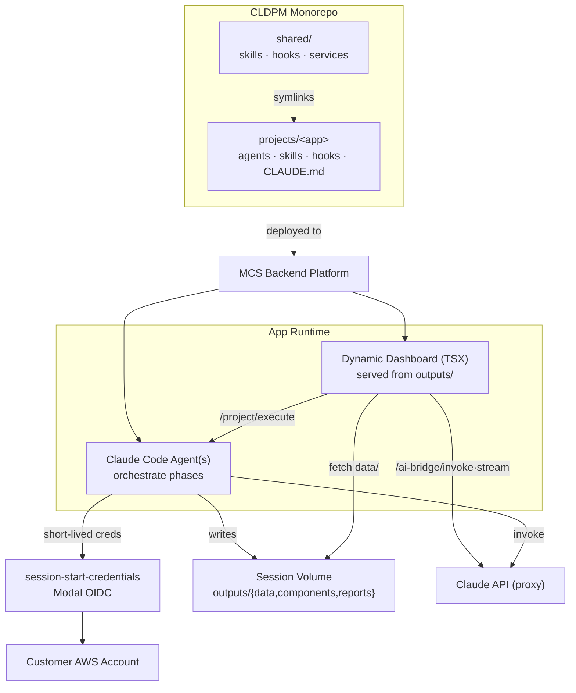
```mermaid
flowchart TD
    subgraph Repo["CLDPM Monorepo"]
        SH["shared/<br/>skills · hooks · services"]
        PROJ["projects/&lt;app&gt;<br/>agents · skills · hooks · CLAUDE.md"]
        SH -. symlinks .-> PROJ
    end

    PROJ -->|deployed to| MCS["MCS Backend Platform"]

    subgraph Runtime["App Runtime"]
        AGENT["Claude Code Agent(s)<br/>orchestrate phases"]
        DASH["Dynamic Dashboard (TSX)<br/>served from outputs/"]
    end

    MCS --> AGENT
    MCS --> DASH

    AGENT -->|short-lived creds| CRED["session-start-credentials<br/>Modal OIDC"]
    CRED --> AWS["Customer AWS Account"]
    AGENT -->|writes| VOL["Session Volume<br/>outputs/{data,components,reports}"]

    DASH -->|fetch data/| VOL
    DASH -->|/project/execute| AGENT
    DASH -->|/ai-bridge/invoke·stream| CLAUDE["Claude API (proxy)"]
    AGENT -->|invoke| CLAUDE
```

**Typical request lifecycle**

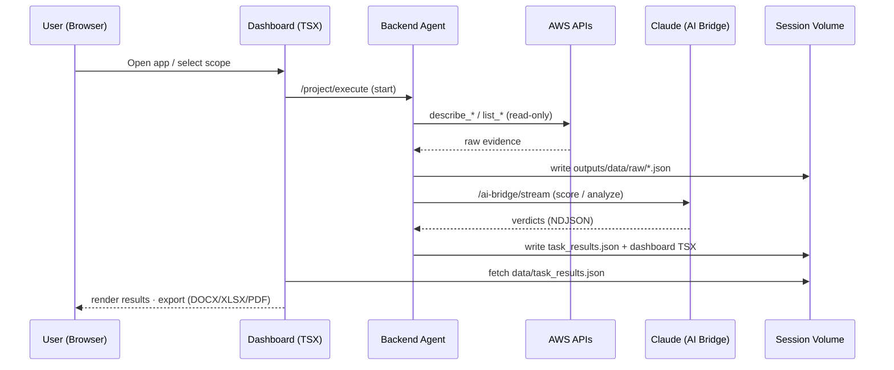
```mermaid
sequenceDiagram
    participant U as User (Browser)
    participant D as Dashboard (TSX)
    participant A as Backend Agent
    participant AWS as AWS APIs
    participant C as Claude (AI Bridge)
    participant V as Session Volume

    U->>D: Open app / select scope
    D->>A: /project/execute (start)
    A->>AWS: describe_* / list_* (read-only)
    AWS-->>A: raw evidence
    A->>V: write outputs/data/raw/*.json
    A->>C: /ai-bridge/stream (score / analyze)
    C-->>A: verdicts (NDJSON)
    A->>V: write task_results.json + dashboard TSX
    D->>V: fetch data/task_results.json
    D-->>U: render results · export (DOCX/XLSX/PDF)
```

---

## 2. Application Index

| App | Category | One-liner |
|-----|----------|-----------|
| [pci-compliance-analysis](#pci-compliance-analysis) | Compliance | PCI-DSS v4.0 posture across all 12 requirement categories |
| [pci-dss-evidence-analyzer](#pci-dss-evidence-analyzer) | Compliance | Auditor-grade PCI v4.0.1 evidence collection + gap assessment |
| [soc2-readiness](#soc2-readiness) | Compliance | SOC 2 Type II readiness scoring of 55 controls |
| [evidence-reviewer](#evidence-reviewer) | Compliance | Bulk evidence ingestion mapped to any control matrix |
| [encryption-audit](#encryption-audit) | Compliance | Encryption-at-rest/in-transit audit across AWS services |
| [cloud-misconfig-scanner](#cloud-misconfig-scanner) | Compliance | S3/RDS/Lambda misconfiguration detection |
| [policy-engine](#policy-engine) | Governance | Branded policy authoring + multi-framework gap analysis |
| [iam-role-rightsize](#iam-role-rightsize) | IAM | Access-Analyzer-driven least-privilege recommendations |
| [user-access-review](#user-access-review) | IAM | PCI-compliant periodic IAM access review (DOCX) |
| [siem-cloudtrail-analyzer](#siem-cloudtrail-analyzer) | SIEM | CloudTrail API audit-log threat detection |
| [siem-cloudwatch-analyzer](#siem-cloudwatch-analyzer) | SIEM | CloudWatch + VPC Flow anomaly detection |
| [siem-guardduty-analyzer](#siem-guardduty-analyzer) | SIEM | GuardDuty finding analysis + IOC extraction |
| [siem-event-correlator](#siem-event-correlator) | SIEM | Cross-source correlation engine + incident detection |
| [siem-soc-analyzer](#siem-soc-analyzer) | SIEM | Tiered L1/L2/L3 SOC analyst pipeline |
| [aws-monitor-guardduty](#aws-monitor-guardduty) | SIEM | Lightweight GuardDuty root-cause + risk scoring |
| [aws-log-analyzer](#aws-log-analyzer) | SIEM | Multi-source log aggregation + correlation |
| [pentest](#pentest) | Offensive | Multi-agent pentest framework, 50+ attack types |
| [cloud-attack-path-analysis](#cloud-attack-path-analysis) | Offensive | Attack-graph discovery with chokepoint analysis |
| [aws-vulnerability-prioritizer](#aws-vulnerability-prioritizer) | Offensive | ECR/Inspector CVE prioritization + impact simulation |
| [threat-radar-generation](#threat-radar-generation) | Offensive | Two-stage passive OSINT tech-stack threat radar |
| [network-diagram-curator](#network-diagram-curator) | Network | Topology diagrams, asset inventory, PCI scoping |
| [network-ruleset-review](#network-ruleset-review) | Network | PCI annual firewall/SG/NACL review (DOCX) |
| [devops-security-remediation](#devops-security-remediation) | Network | Find 0.0.0.0/0 rules + generate remediation scripts |
| [cloud-cost-monitor](#cloud-cost-monitor) | FinOps | Right-sizing, RI/SP optimization, anomaly detection |
| [devops-simulation-training](#devops-simulation-training) | Training | Gamified incident-response simulations |
| [tabletop-exercise](#tabletop-exercise) | Training | AI DR tabletop scenarios from real inventory |
| [phishing-simulator](#phishing-simulator) | Training | Gamified phishing-awareness academy |
| [security-dashboard-hub](#security-dashboard-hub) | Hub | Role-based aggregation of all project outputs |
| [custom-task](#custom-task) | Framework | Generic ad-hoc task + dashboard generator |
| [Updated_evidence_review](#updated_evidence_review) | — | Empty placeholder |

---

## 3. Compliance & Evidence

### pci-compliance-analysis

*A turnkey PCI-DSS assessment engine that converts a live AWS account into a scored compliance picture. It closes the gap between raw cloud configuration and the auditor's 12-requirement checklist, letting teams see exactly where they stand—and what to remediate—well before a QSA arrives.*
**Purpose** — Analyze AWS infrastructure for PCI-DSS v4.0 compliance across all 12 requirement categories and produce an interactive scored dashboard.
**Inputs / data sources** — EC2, RDS, S3, IAM, CloudTrail, AWS Config, KMS, GuardDuty, Security Hub via `describe_*`/`get_*`.
**How it works** — Collect infrastructure across 8+ services → evaluate each of the 12 requirement categories → map services to requirements (EC2 SG→Req 1, CloudTrail→Req 10) → score PASS/FAIL/REVIEW aggregated to 0–100% → classify findings by severity → embed real data into a TSX component, compile, render.
**Agents & skills** — No agents; `pci-compliance-analysis` skill + `dashboard-creation-skill`. Hooks: `session-start-credentials`, `gemini-postprocess`, `update-imports`.
**Outputs** — `compliance_analysis.json`, `ComplianceDashboard.tsx/js` (gauge, pie, findings table), `pci_compliance_report.md`.
**Frameworks** — PCI-DSS v4.0 (all 12 requirements).

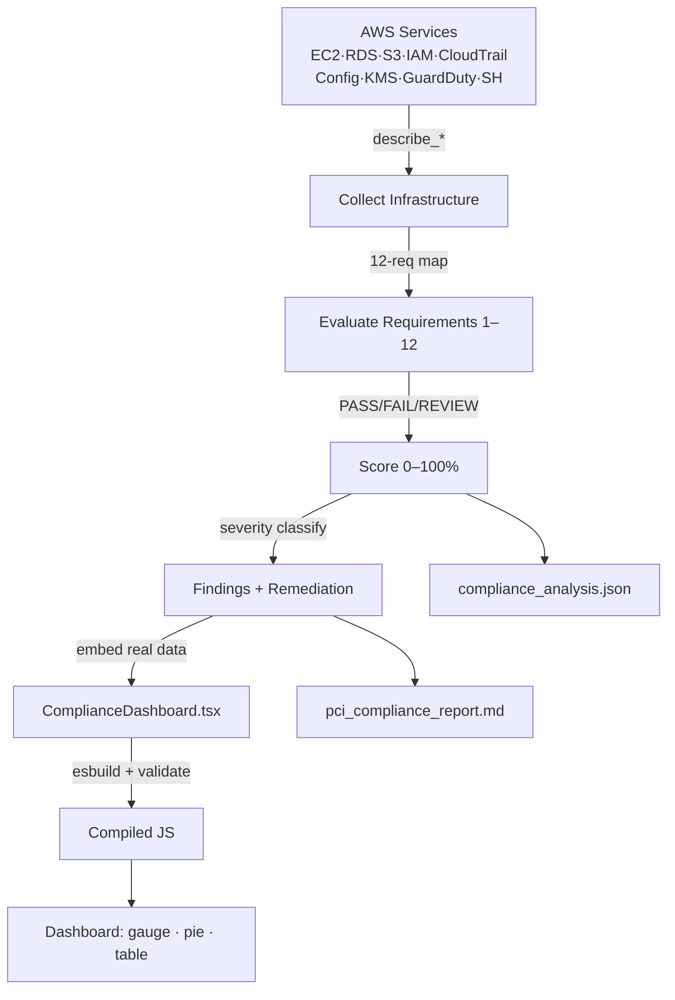
```mermaid
flowchart TD
    A["AWS Services<br/>EC2·RDS·S3·IAM·CloudTrail<br/>Config·KMS·GuardDuty·SH"] -->|describe_*| B["Collect Infrastructure"]
    B -->|12-req map| C["Evaluate Requirements 1–12"]
    C -->|PASS/FAIL/REVIEW| D["Score 0–100%"]
    D -->|severity classify| E["Findings + Remediation"]
    E -->|embed real data| F["ComplianceDashboard.tsx"]
    F -->|esbuild + validate| G["Compiled JS"]
    D --> H["compliance_analysis.json"]
    E --> I["pci_compliance_report.md"]
    G --> J["Dashboard: gauge · pie · table"]
```

### pci-dss-evidence-analyzer

*An auditor-facing workbench that automates the most laborious part of a PCI engagement: gathering evidence and reconciling it against 133 requirements. Scoping questions and asset uploads keep the assessment honest about what is genuinely in scope, while streamed AI verdicts and an evidence-grounded chat let reviewers interrogate every conclusion.*
**Purpose** — Auditor-grade PCI-DSS v4.0.1 evidence collection, mapping, and gap assessment from AWS via a unified 5-phase dashboard workflow.
**Inputs / data sources** — 20+ AWS services via Modal OIDC; an 11-question scoping questionnaire; optional asset inventory (CSV/XLSX) and auditor sample-set uploads.
**How it works** — **Start** → **Collecting** (parallel AWS fetch with progress; scoping + asset uploads in side pane) → **Mapped** (category tallies, in-scope vs auto-N/A, naming + sample-coverage checks) → **Reviewing** (Claude Sonnet 4.6 streams NDJSON verdicts for in-scope parent requirements) → **Results** (Overview, All Requirements, Raw Evidence, Auditor Chat).
**Agents & skills** — Single `pci-dss-evidence-analyzer-agent`; `dashboard-creation` + `platform-api` deps; AI Bridge streaming.
**Outputs** — 7-sheet Excel report, raw evidence JSON by category, snapshot history.
**Frameworks** — PCI-DSS v4.0.1 (133 requirements, Defined Approach matrix).

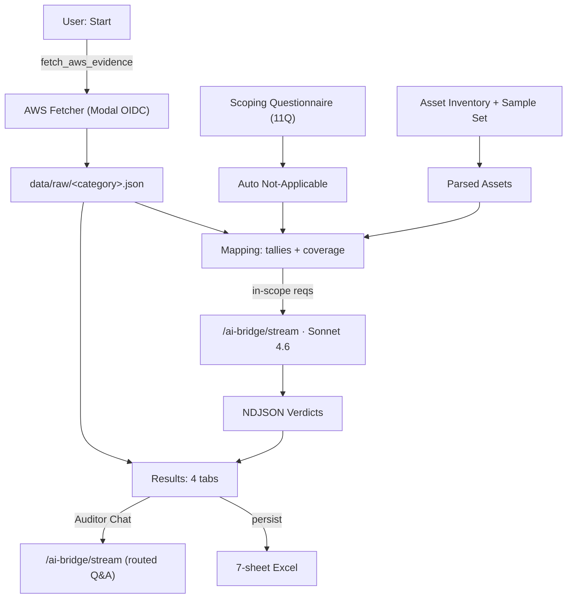
```mermaid
flowchart TD
    Start["User: Start"] -->|fetch_aws_evidence| Fetch["AWS Fetcher (Modal OIDC)"]
    Fetch --> Raw["data/raw/&lt;category&gt;.json"]
    Quest["Scoping Questionnaire (11Q)"] --> NA["Auto Not-Applicable"]
    Asset["Asset Inventory + Sample Set"] --> Parsed["Parsed Assets"]
    Raw --> Map["Mapping: tallies + coverage"]
    NA --> Map
    Parsed --> Map
    Map -->|in-scope reqs| Rev["/ai-bridge/stream · Sonnet 4.6"]
    Rev --> Verd["NDJSON Verdicts"]
    Verd --> Res["Results: 4 tabs"]
    Raw --> Res
    Res -->|persist| Excel["7-sheet Excel"]
    Res -->|Auditor Chat| QA["/ai-bridge/stream (routed Q&A)"]
```

### soc2-readiness

*A pre-audit readiness check that scores an organization against all 55 SOC 2 Trust Service Criteria using evidence pulled directly from AWS. Built for the run-up to a Type II audit, it surfaces gaps early and produces an audit-ready workbook with full evidence traceability.*
**Purpose** — SOC 2 Type II readiness assessment with server-side evidence collection, control scoring, and audit-grade reporting with raw-evidence visibility.
**Inputs / data sources** — AWS (IAM, KMS, S3, EC2 network, logging, security services, backup, certificates) across 41 resource categories; customer name + assessment type; optional policy docs/screenshots for OCR.
**How it works** — Select org + region → fetch 41 AWS evidence categories via boto3 → score all 55 SOC 2 controls against raw evidence using AI Bridge (streaming verdicts) → 5-tab dashboard (scorecard, controls, evidence browser, auditor chat, missing-evidence request) → persist to markdown + 6-sheet Excel.
**Agents & skills** — `soc2-readiness-agent`; `dynamic-dashboard`, `platform-api`; `session-start-credentials`; AI Bridge streaming for cited auditor chat.
**Outputs** — `SOC2ReadinessDashboard.tsx`, `task_results.json` (55 verdicts + score), markdown report, 6-sheet Excel, raw evidence JSON.
**Frameworks** — SOC 2 Type II (55 Trust Service Criteria controls).

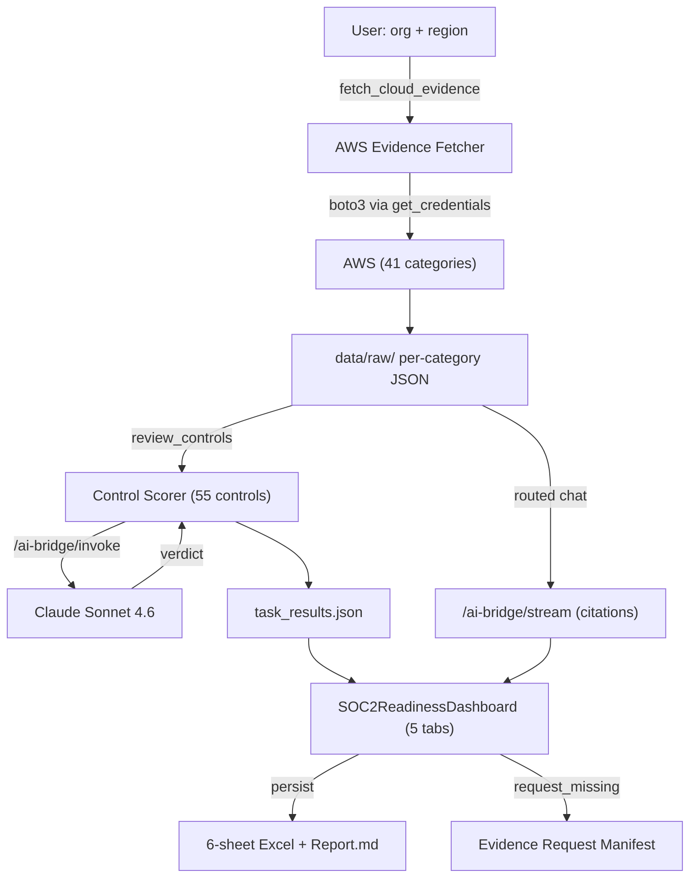
```mermaid
flowchart TD
    A["User: org + region"] -->|fetch_cloud_evidence| B["AWS Evidence Fetcher"]
    B -->|boto3 via get_credentials| C["AWS (41 categories)"]
    C --> D["data/raw/ per-category JSON"]
    D -->|review_controls| E["Control Scorer (55 controls)"]
    E -->|/ai-bridge/invoke| F["Claude Sonnet 4.6"]
    F -->|verdict| E
    E --> G["task_results.json"]
    G --> H["SOC2ReadinessDashboard (5 tabs)"]
    D -->|routed chat| I["/ai-bridge/stream (citations)"]
    I --> H
    H -->|persist| J["6-sheet Excel + Report.md"]
    H -->|request_missing| K["Evidence Request Manifest"]
```

### evidence-reviewer

*A framework-agnostic triage tool for compliance teams buried in screenshots, PDFs, and configuration dumps. It ingests hundreds of artifacts in the browser, fuzzy-matches them to whatever control matrix you upload, and uses Claude to render a defensible per-control verdict.*
**Purpose** — Ingest bulk compliance evidence (200–300+ files), map to control matrices, and use Claude to review each control against a chosen framework.
**Inputs / data sources** — Drag-and-drop evidence (PDF, image, text, Excel, Word); CSV/JSON control matrices; framework-agnostic field mapping.
**How it works** — In-browser bulk ingestion (FileReader text + base64 images) → parse control matrix with flexible field mapping → keyword fuzzy-match evidence↔controls with manual override → per-control Claude review via `/ai-bridge/invoke` (analyst persona, structured JSON) → compliance dashboard with filtering and CSV/JSON export.
**Agents & skills** — No agents; `dashboard-creation-skill`, `interactive-user-actions`, `ai-bridge`.
**Outputs** — `EvidenceReviewDashboard.tsx`, `task_results.json` (verdicts + observations), gap analysis, CSV/JSON exports, markdown report.
**Frameworks** — PCI-DSS v4.0.1, SOC 2 Type II, ISO 27001:2022, HIPAA, NIST 800-53 Rev 5, custom.

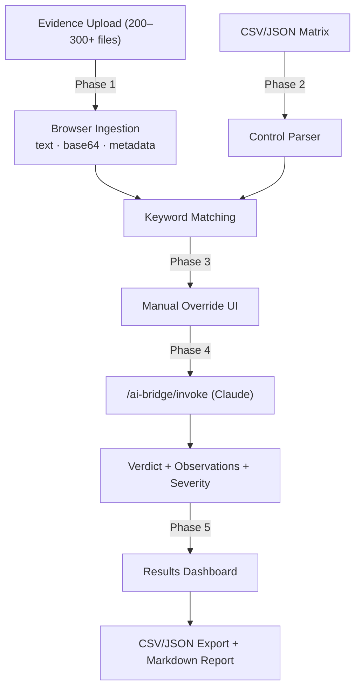
```mermaid
flowchart TD
    A["Evidence Upload (200–300+ files)"] -->|Phase 1| B["Browser Ingestion<br/>text · base64 · metadata"]
    C["CSV/JSON Matrix"] -->|Phase 2| D["Control Parser"]
    B --> E["Keyword Matching"]
    D --> E
    E -->|Phase 3| F["Manual Override UI"]
    F -->|Phase 4| G["/ai-bridge/invoke (Claude)"]
    G --> H["Verdict + Observations + Severity"]
    H -->|Phase 5| I["Results Dashboard"]
    I --> J["CSV/JSON Export + Markdown Report"]
```

### encryption-audit

*A focused sweep for unprotected data across the AWS estate, answering one high-stakes question—"is anything sensitive left unencrypted?"—across EBS, RDS, S3, DynamoDB, and KMS, at rest and in transit.*
**Purpose** — Audit encryption status across AWS resources (EBS, RDS, S3, DynamoDB, KMS) and surface unencrypted data.
**Inputs / data sources** — EBS volumes, RDS instances, S3 buckets, DynamoDB tables, KMS keys; credentials via `session-start-credentials`.
**How it works** — Retrieve credentials → EBS scanner (volume + snapshot encryption) → RDS scanner (at-rest, SSL/TLS, snapshots) → S3 scanner (SSE + default encryption) → DynamoDB/KMS analyzers (key config + rotation) → dashboard highlighting unencrypted resources by service.
**Agents & skills** — `aws_credential_manager` agent; `encryption-compliance-checker` skill; `dashboard-creation-skill`, `platform-api`.
**Outputs** — `unencrypted_resources.json`, `encryption_summary.json`, `kms_key_inventory.json`, `EncryptionDashboard.tsx`, audit + remediation reports.
**Frameworks** — PCI-DSS 3.4 / 4.1, HIPAA encryption, SOC 2.

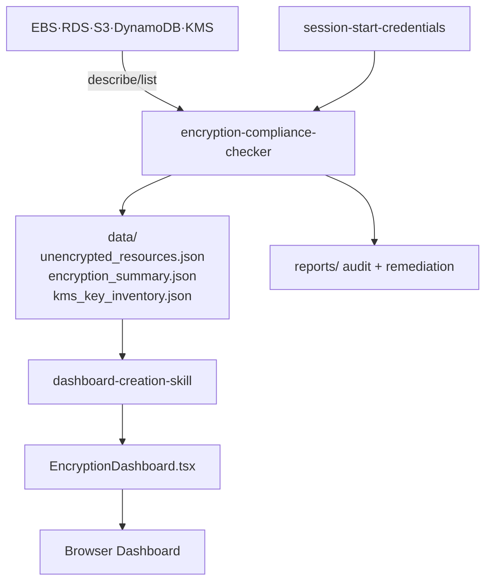
```mermaid
flowchart TD
    A["EBS·RDS·S3·DynamoDB·KMS"] -->|describe/list| B["encryption-compliance-checker"]
    C["session-start-credentials"] --> B
    B --> D["data/<br/>unencrypted_resources.json<br/>encryption_summary.json<br/>kms_key_inventory.json"]
    D --> E["dashboard-creation-skill"]
    E --> F["EncryptionDashboard.tsx"]
    B --> G["reports/ audit + remediation"]
    F --> H["Browser Dashboard"]
```

### cloud-misconfig-scanner

*A targeted scanner for the misconfigurations behind most cloud breaches: public buckets, unlogged databases, over-exposed functions. It inspects S3, RDS, and Lambda and returns severity-ranked findings paired with concrete fixes.*
**Purpose** — Identify security misconfigurations across S3, RDS, and Lambda and generate remediation guidance.
**Inputs / data sources** — S3 buckets, RDS instances, Lambda functions; credentials via hook.
**How it works** — Retrieve credentials → S3 scanner (policies, ACLs, encryption, public access) → RDS scanner (logging, encryption, SSL/TLS, network) → Lambda scanner (env vars, exec roles, VPC, secrets) → generate TSX dashboards → synthesize markdown with severity + remediation.
**Agents & skills** — `aws_credential_manager`; `s3/rds/lambda-security-scanner` skills; `dashboard-creation-skill`.
**Outputs** — `s3/rds/lambda_findings.json`, three TSX dashboards, severity-graded markdown reports.
**Frameworks** — PCI-DSS 3.4 / 7.1 / 10.2; CIS AWS Foundations 2.1.x.

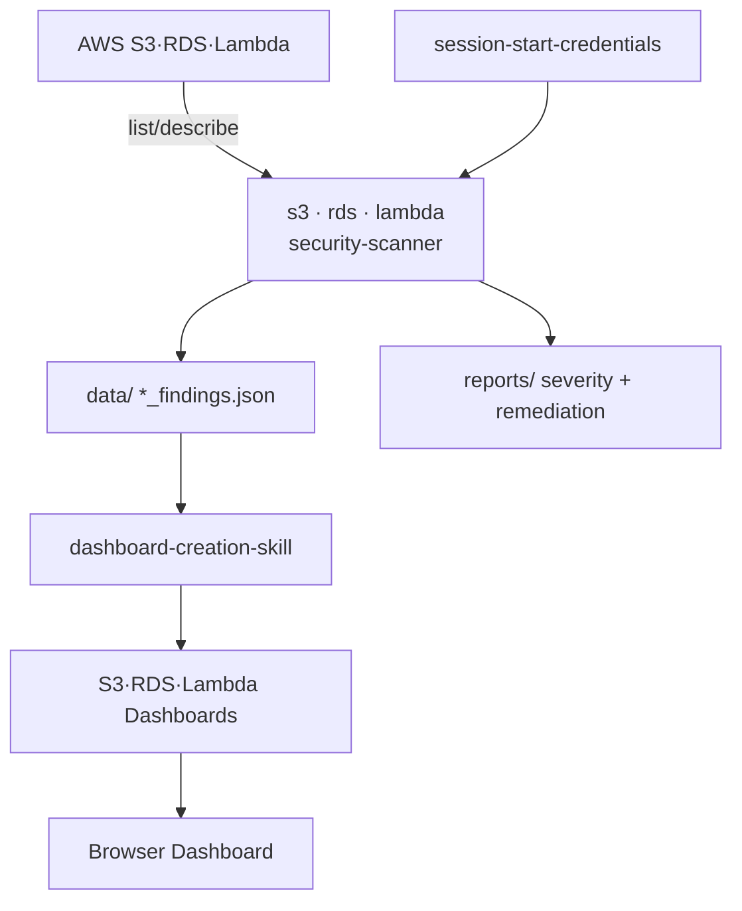
```mermaid
flowchart TD
    A["AWS S3·RDS·Lambda"] -->|list/describe| B["s3 · rds · lambda<br/>security-scanner"]
    C["session-start-credentials"] --> B
    B --> D["data/ *_findings.json"]
    D --> E["dashboard-creation-skill"]
    E --> F["S3·RDS·Lambda Dashboards"]
    B --> G["reports/ severity + remediation"]
    F --> H["Browser Dashboard"]
```

### policy-engine

*A document factory and reviewer for information-security policies. It authors brand-aligned policy sets from a 473-point control library and, in reverse, audits existing policies for framework-coverage gaps.*
**Purpose** — Framework-aligned policy creator and reviewer; generates branded PDF/DOCX policies and performs multi-framework gap analysis.
**Inputs / data sources** — Framework selection (PCI-DSS v4.0.1, ISO 27001/27002:2022, SOC 2 TSC 2017, HIPAA); org metadata + logo; for review mode, an existing policy PDF/DOCX.
**How it works** — Choose Create or Review → select framework(s) + enter org details (logo → co-brand + color extraction) → **Create**: pick style + target policies from a 473-control-point index, Claude generates branded PDF → **Review**: parse uploaded policy, cross-map to controls, score missing controls by severity → output PDF (create) or XLSX + PDF (review).
**Agents & skills** — No agents; `policy-engine` skill via `dynamic-dashboard`; AI Bridge invoke/stream.
**Outputs** — Branded 7-section PDF policies; gap-analysis XLSX + PDF summary.
**Frameworks** — PCI-DSS v4.0.1 (203 sub-reqs), ISO 27001/27002:2022 (93 controls), SOC 2 TSC 2017 (90 criteria), HIPAA (49 specs).

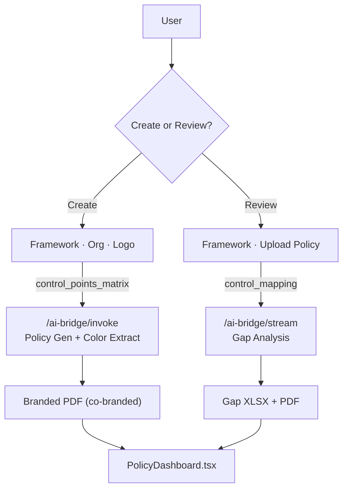
```mermaid
flowchart TD
    U["User"] --> M{"Create or Review?"}
    M -->|Create| CF["Framework · Org · Logo"]
    M -->|Review| RF["Framework · Upload Policy"]
    CF -->|control_points_matrix| PG["/ai-bridge/invoke<br/>Policy Gen + Color Extract"]
    PG --> CO["Branded PDF (co-branded)"]
    RF -->|control_mapping| GA["/ai-bridge/stream<br/>Gap Analysis"]
    GA --> RO["Gap XLSX + PDF"]
    CO --> D["PolicyDashboard.tsx"]
    RO --> D
```

---

## 4. IAM & Access

### iam-role-rightsize

*A least-privilege engine that confronts permission sprawl in AWS IAM. By contrasting what roles are allowed to do against what they actually use, it recommends precise reductions and flags roles safe to retire.*
**Purpose** — Analyze IAM roles/policies with Access Analyzer to identify over-permissive access and generate right-sized recommendations + removal candidates.
**Inputs / data sources** — IAM role inventory; Access Analyzer findings (unused permissions, external access); CloudTrail for usage patterns.
**How it works** — Enumerate roles (`iam:List*`/`Get*`) → analyze CloudTrail usage → Access Analyzer for unused/external access → risk-score over-permission (1–10), flag admin/wildcard/cross-account, compare required vs actual → generate P0–P3 removal + consolidation recommendations → dashboard with before/after policy comparison.
**Agents & skills** — `iam-rightsize-agent`, `aws_credential_manager`; `iam-rightsize-skill`; `dashboard-creation-skill`.
**Outputs** — Role inventory + findings JSON, right-size recommendations, removal candidates, risk heatmap dashboard, compliance-mapped markdown.
**Frameworks** — PCI-DSS 7.1–7.2, CIS AWS 1.16/1.22, SOC 2 CC6.1/CC6.3, NIST AC-6.

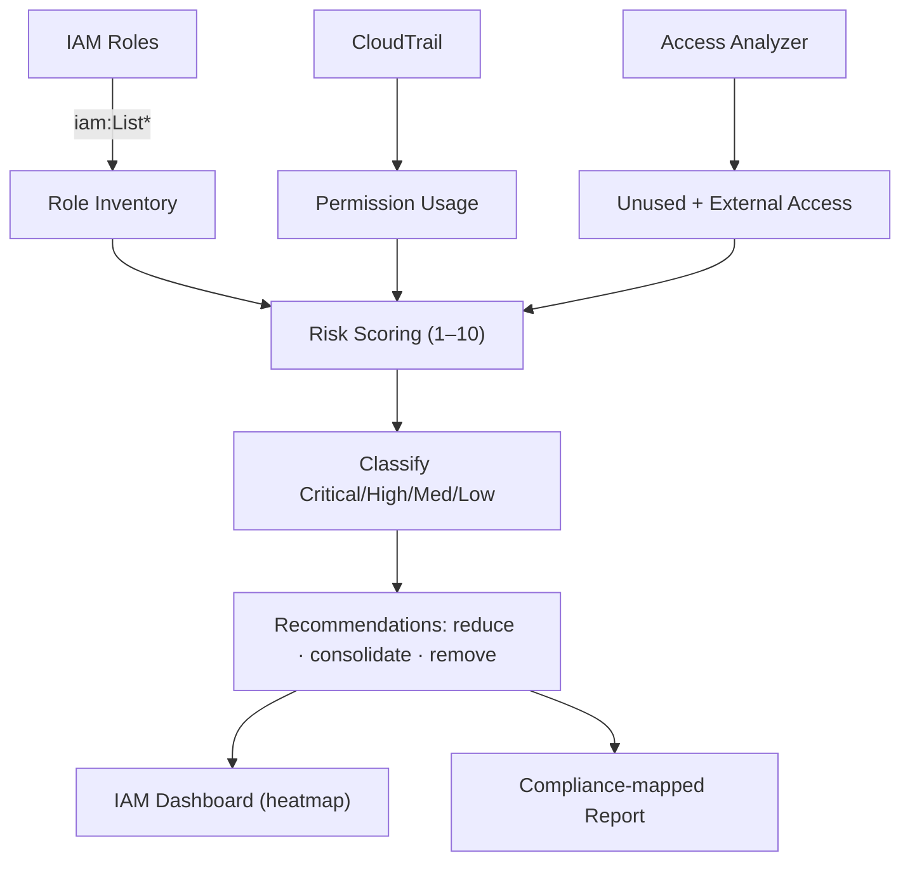
```mermaid
flowchart TD
    A["IAM Roles"] -->|iam:List*| B["Role Inventory"]
    C["CloudTrail"] --> D["Permission Usage"]
    E["Access Analyzer"] --> F["Unused + External Access"]
    B --> G["Risk Scoring (1–10)"]
    D --> G
    F --> G
    G --> H["Classify Critical/High/Med/Low"]
    H --> I["Recommendations: reduce · consolidate · remove"]
    I --> J["IAM Dashboard (heatmap)"]
    I --> K["Compliance-mapped Report"]
```

### user-access-review

*An automation of the recurring access-recertification chore auditors demand. It compiles IAM identities, scrutinizes privilege breadth and MFA hygiene, and produces a sign-off-ready Word report.*
**Purpose** — PCI-DSS v4.0 compliant periodic user access review and IAM access analysis, producing an audit-grade Word report.
**Inputs / data sources** — IAM inventory (users, roles, policies, access keys, MFA) via boto3 / CLI export; optional historical access data; customer + review period.
**How it works** — Collect IAM data → analyze permissions, flag broad policies (Administrator/PowerUser), check key rotation + MFA → assign CRITICAL/HIGH/MEDIUM/LOW by breadth, key age, MFA, last login → map to PCI-DSS 7.x/8.x → generate 16-section DOCX with color-coded risk tables, score, remediation.
**Agents & skills** — `user-access-review-agent`; `user-access-review` skill (analysis + DOCX); `dashboard-creation-skill`, `platform-api`.
**Outputs** — 16-section Word report, optional filterable React dashboard, JSON analysis files.
**Frameworks** — PCI-DSS v4.0 7.1/7.2, 8.1/8.2/8.3.

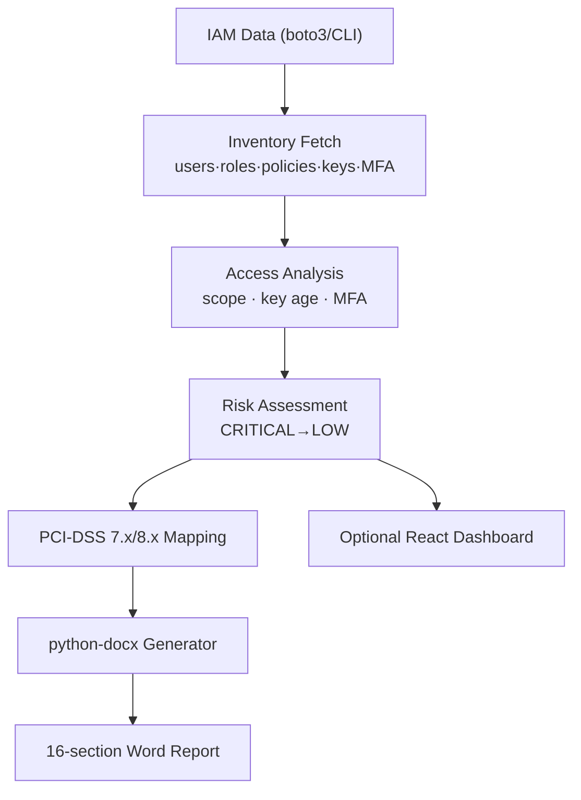
```mermaid
flowchart TD
    A["IAM Data (boto3/CLI)"] --> B["Inventory Fetch<br/>users·roles·policies·keys·MFA"]
    B --> C["Access Analysis<br/>scope · key age · MFA"]
    C --> D["Risk Assessment<br/>CRITICAL→LOW"]
    D --> E["PCI-DSS 7.x/8.x Mapping"]
    E --> F["python-docx Generator"]
    F --> G["16-section Word Report"]
    D --> H["Optional React Dashboard"]
```

---

## 5. SIEM & Threat Detection

The SIEM family is a **producer/consumer pipeline**: three source analyzers (CloudTrail, CloudWatch, GuardDuty) normalize events to **Common Event Format (CEF)** and export them; the **event-correlator** consumes all three for cross-source incident detection. The **soc-analyzer** is an independent tiered L1/L2/L3 pipeline.

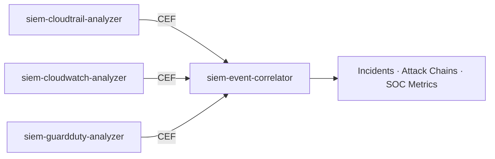
```mermaid
flowchart LR
    CT["siem-cloudtrail-analyzer"] -->|CEF| EC["siem-event-correlator"]
    CW["siem-cloudwatch-analyzer"] -->|CEF| EC
    GD["siem-guardduty-analyzer"] -->|CEF| EC
    EC --> INC["Incidents · Attack Chains · SOC Metrics"]
```

### siem-cloudtrail-analyzer

*The control-plane sensor of the SIEM suite, mining CloudTrail for who-did-what across the account. It turns API audit logs into threat detections and a normalized event feed for downstream correlation.*
**Purpose** — Collect, normalize, and analyze CloudTrail API audit logs with AI threat detection, IAM analysis, MITRE mapping, and 365-day retention.
**Inputs / data sources** — CloudTrail API (LookupEvents, GetTrailStatus), S3 CloudTrail buckets, IAM + Config for context.
**How it works** — Ingest recent API events + S3 historical logs into DuckDB → normalize to CEF + categorize → SQL-based threat detection, privilege-escalation, user behavior profiling → map MITRE + risk score via AI Bridge → generate dashboards → export CEF to correlator.
**Agents & skills** — `cloudtrail-collector-agent` (L1), `cloudtrail-security-analyst` (L2/L3); `cloudtrail-siem-skill`, `ai-bridge`.
**Outputs** — `cloudtrail_events.json`, `iam_activity.json`, `auth_events.json`, threat/IAM/compliance reports, CloudTrail dashboards.
**Frameworks** — PCI-DSS 10.x, NIST IA-2/AC-6, SOC 2 CC6.1.

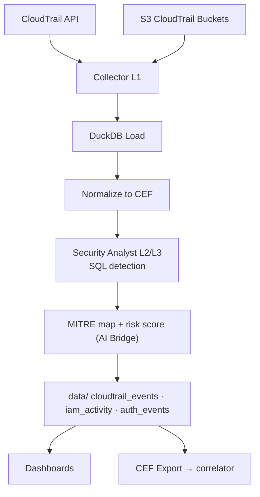
```mermaid
flowchart TD
    A["CloudTrail API"] --> B["Collector L1"]
    C["S3 CloudTrail Buckets"] --> B
    B --> D["DuckDB Load"]
    D --> E["Normalize to CEF"]
    E --> F["Security Analyst L2/L3<br/>SQL detection"]
    F --> G["MITRE map + risk score (AI Bridge)"]
    G --> H["data/ cloudtrail_events · iam_activity · auth_events"]
    H --> I["Dashboards"]
    H --> J["CEF Export → correlator"]
```

### siem-cloudwatch-analyzer

*The network- and application-layer sensor of the SIEM suite. It mines CloudWatch and VPC Flow Logs for the anomalies signature tools miss—port scans, data exfiltration, command-and-control beacons.*
**Purpose** — Collect and analyze CloudWatch logs (VPC Flow, app, Lambda, ECS/EKS) with statistical anomaly detection and network threat analysis.
**Inputs / data sources** — CloudWatch Logs API, VPC Flow Logs, alarms/metrics, Lambda logs, ECS/EKS logs, API Gateway access logs.
**How it works** — Discover log groups across regions and pull flows/app/container logs → normalize to CEF → anomaly detection (Z-score, baselines, cardinality) → VPC-flow SQL detects port scans, exfiltration, C2, lateral movement → AI Bridge MITRE enrichment → export CEF to correlator.
**Agents & skills** — `cloudwatch-collector-agent` (L1), `cloudwatch-security-analyst` (L2/L3); `cloudwatch-siem-skill`, `ai-bridge`.
**Outputs** — `vpc_flow_analysis.json`, `network_anomalies.json`, `application_errors.json`, `lambda_analysis.json`, network/anomaly reports, dashboards.
**Frameworks** — PCI-DSS 10.x / 11.4, NIST SI-4, SOC 2 CC6.1/CC7.2.

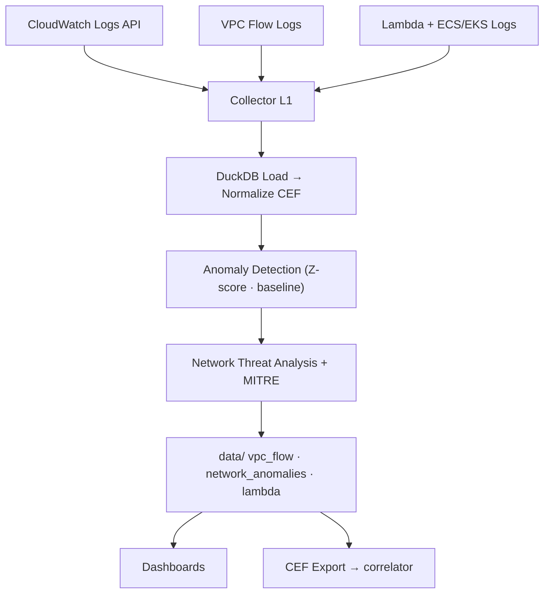
```mermaid
flowchart TD
    A["CloudWatch Logs API"] --> B["Collector L1"]
    C["VPC Flow Logs"] --> B
    D["Lambda + ECS/EKS Logs"] --> B
    B --> E["DuckDB Load → Normalize CEF"]
    E --> F["Anomaly Detection (Z-score · baseline)"]
    F --> G["Network Threat Analysis + MITRE"]
    G --> H["data/ vpc_flow · network_anomalies · lambda"]
    H --> I["Dashboards"]
    H --> J["CEF Export → correlator"]
```

### siem-guardduty-analyzer

*A force-multiplier on top of GuardDuty that adds root-cause analysis, IOC extraction, and risk context to raw findings, transforming isolated alerts into prioritized, framework-mapped intelligence.*
**Purpose** — Collect and analyze GuardDuty findings with AI threat detection, root-cause analysis, IOC extraction, and risk scoring.
**Inputs / data sources** — GuardDuty API (ListDetectors/Findings/GetFindings across regions), CloudTrail for root cause, EC2/IAM/S3 for context.
**How it works** — Enumerate detectors across regions → retrieve findings (90-day lookback) → normalize to CEF + extract IOCs (IPs, domains, hashes, UAs) → root-cause via CloudTrail correlation, impact/likelihood scoring, MITRE mapping → AI Bridge threat assessment + FP filtering → compliance mapping → export CEF.
**Agents & skills** — `guardduty-collector-agent` (L1), `guardduty-threat-analyst` (L2/L3); `guardduty-siem-skill`, `ai-bridge`.
**Outputs** — `guardduty_findings.json`, `guardduty_iocs.json`, `guardduty_risk_scores.json`, executive/threat/IOC/compliance reports, dashboards.
**Frameworks** — PCI-DSS 10.6/11.4/12.10, SOC 2 CC6.6, NIST SI-4, CIS AWS 3.10/3.11.

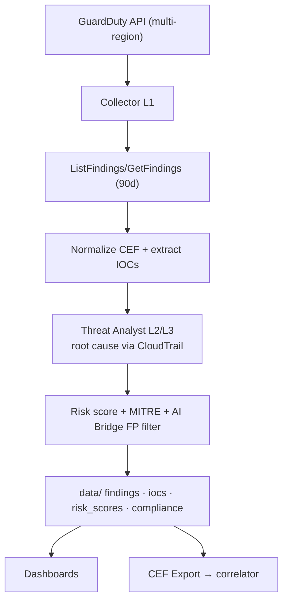
```mermaid
flowchart TD
    A["GuardDuty API (multi-region)"] --> B["Collector L1"]
    B --> C["ListFindings/GetFindings (90d)"]
    C --> D["Normalize CEF + extract IOCs"]
    D --> E["Threat Analyst L2/L3<br/>root cause via CloudTrail"]
    E --> F["Risk score + MITRE + AI Bridge FP filter"]
    F --> G["data/ findings · iocs · risk_scores · compliance"]
    G --> H["Dashboards"]
    G --> I["CEF Export → correlator"]
```

### siem-event-correlator

*The brain of the SIEM suite, fusing all three sensor feeds into multi-stage attack narratives. Single-source alerts that look benign in isolation become recognizable kill chains—credential theft, lateral movement, ransomware.*
**Purpose** — Master correlation engine aggregating GuardDuty + CloudWatch + CloudTrail CEF events for cross-source incident detection and SOC dashboards.
**Inputs / data sources** — CEF JSON from the three source analyzers (90/365-day retention).
**How it works** — Ingest CEF from all sources → dedupe → apply time-window (5m–72h), entity, sequence, threshold, aggregation rules → execute 10 cross-source rules (credential-compromise chain, exfiltration, lateral movement, privilege escalation, crypto-mining, defense evasion, insider threat, account takeover, supply chain, ransomware) → AI Bridge linking + narrative + FP reduction → classify P0–P3 → generate containment/remediation playbooks.
**Agents & skills** — `correlation-orchestrator`, `incident-detector`, `threat-intelligence-analyst`; `event-correlation-skill`, `ai-bridge`.
**Outputs** — `correlated_events.json`, `incidents.json`, `alerts.json`, `attack_chains.json`, `threat_landscape.json`, `soc_metrics.json`; correlation/incident/SOC reports; 8 dashboard views.
**Frameworks** — PCI-DSS 10.6/11.4/12.10, SOC 2 CC6.6/CC7.2/CC7.3, NIST SI-4/IR-4/IR-5, ISO 27001 A.16.1.

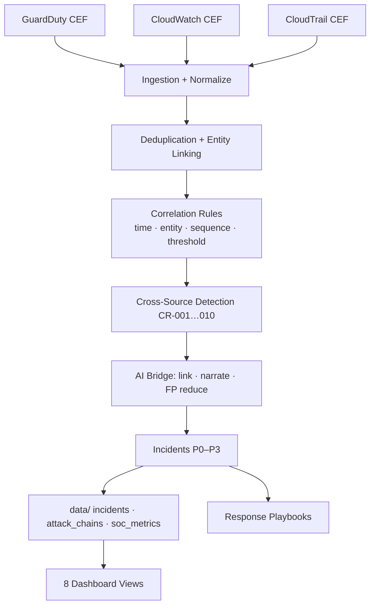
```mermaid
flowchart TD
    A["GuardDuty CEF"] --> B["Ingestion + Normalize"]
    C["CloudWatch CEF"] --> B
    D["CloudTrail CEF"] --> B
    B --> E["Deduplication + Entity Linking"]
    E --> F["Correlation Rules<br/>time · entity · sequence · threshold"]
    F --> G["Cross-Source Detection CR-001…010"]
    G --> H["AI Bridge: link · narrate · FP reduce"]
    H --> I["Incidents P0–P3"]
    I --> J["data/ incidents · attack_chains · soc_metrics"]
    J --> K["8 Dashboard Views"]
    I --> L["Response Playbooks"]
```

### siem-soc-analyzer

*A virtual SOC that mirrors how a real one is staffed, escalating events through L1, L2, and L3 analyst tiers. It triages noise, investigates what matters, and hunts confirmed incidents to closure—generating detection rules along the way.*
**Purpose** — Tiered L1/L2/L3 SOC analyst pipeline for alert triage, correlation, threat hunting, detection-rule creation, and incident response.
**Inputs / data sources** — Raw SIEM events from CloudWatch/CloudTrail, Windows Event Logs, Linux syslog/auditd, normalized to CEF.
**How it works** — **L1 Triage**: normalize CEF, match a 135-rule use-case library, classify P0–P3, filter FPs, escalate → **L2 Investigation**: time-window/entity correlation, threat-intel enrichment (VirusTotal, AbuseIPDB, OTX), MITRE mapping, root-cause, incident determination → **L3 Hunting**: forensics, generate Sigma/YARA/Suricata rules, compliance mapping, IR playbooks, executive reports + SOC KPIs (MTTD, MTTR, FP rate).
**Agents & skills** — `l1-triage-analyst`, `l2-investigation-analyst`, `l3-threat-hunter`; `siem-data-processor`, `dashboard-creation-skill`, `interactive-user-actions`, `platform-api`.
**Outputs** — `triaged_alerts.json`, `investigation_findings.json`, `incident_timeline.json`, `threat_analysis.json`, incident/threat reports, `SOCDashboard.tsx`.
**Frameworks** — PCI-DSS 4.0 (10/11/12.x), ISO 27001 A.12/A.16, SOC 2 CC6/7/8, NIST AU/IR/SI, HIPAA §164.312/.308, CIS v8, MITRE ATT&CK v14.

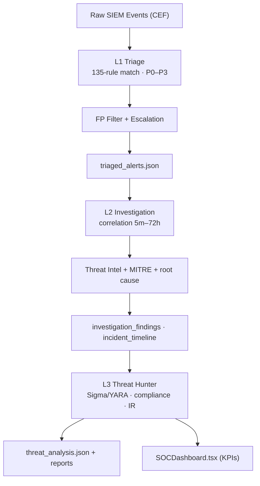
```mermaid
flowchart TD
    A["Raw SIEM Events (CEF)"] --> B["L1 Triage<br/>135-rule match · P0–P3"]
    B --> C["FP Filter + Escalation"]
    C --> D["triaged_alerts.json"]
    D --> E["L2 Investigation<br/>correlation 5m–72h"]
    E --> F["Threat Intel + MITRE + root cause"]
    F --> G["investigation_findings · incident_timeline"]
    G --> H["L3 Threat Hunter<br/>Sigma/YARA · compliance · IR"]
    H --> I["threat_analysis.json + reports"]
    H --> J["SOCDashboard.tsx (KPIs)"]
```

### aws-monitor-guardduty

*A lightweight companion to GuardDuty for teams that want quick root-cause and risk scoring without standing up the full SIEM pipeline.*
**Purpose** — Lightweight GuardDuty analysis: root cause, probable cause, impact, and probability-weighted risk scores.
**Inputs / data sources** — GuardDuty findings; CloudTrail for correlation.
**How it works** — Retrieve findings → correlate with CloudTrail for root access patterns → compute impact(1–10) × likelihood(1–10) ÷ 10 risk → map PCI/CIS/SOC2/NIST → generate executive summary + remediation → JSON + markdown + dashboard.
**Agents & skills** — `aws_credential_manager`; `aws-monitor-guardduty-skill`.
**Outputs** — `guardduty_findings/analysis/risk_scores/correlations.json`, markdown report, `GuardDutyDashboard.tsx`.
**Frameworks** — PCI-DSS, CIS AWS Foundations, SOC 2, NIST.

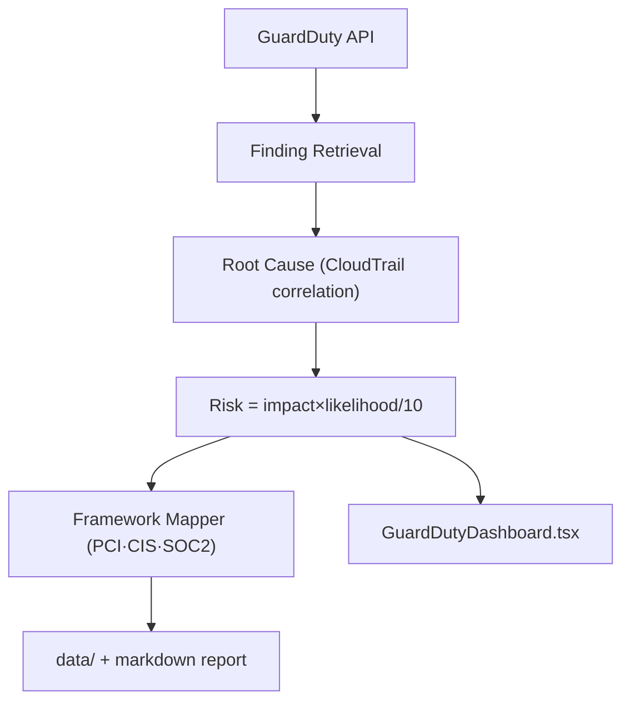
```mermaid
flowchart TD
    A["GuardDuty API"] --> B["Finding Retrieval"]
    B --> C["Root Cause (CloudTrail correlation)"]
    C --> D["Risk = impact×likelihood/10"]
    D --> E["Framework Mapper (PCI·CIS·SOC2)"]
    E --> F["data/ + markdown report"]
    D --> G["GuardDutyDashboard.tsx"]
```

### aws-log-analyzer

*A cross-source log-forensics tool that stitches six AWS log streams into a single timeline. It is built for the investigator's core question: what actually happened, and when?*
**Purpose** — Aggregate and analyze logs from five+ AWS sources to detect anomalies, support forensics, and monitor PCI logging compliance.
**Inputs / data sources** — CloudTrail, CloudWatch, VPC Flow Logs, S3 Access Logs, GuardDuty, WAF via APIs + S3.
**How it works** — Aggregate across sources (read-only) → cross-correlate events to reveal coordinated attacks → anomaly detection (geographic, temporal, volume, behavioral, sequential) → reconstruct incident timelines → emit findings with user-activity + privilege-escalation tracking.
**Agents & skills** — `aws-log-analyzer-agent`, `aws_credential_manager`; `aws-log-analyzer-skill`.
**Outputs** — `cloudtrail_events/vpc_flow_logs/security_findings/anomalies/user_activity/incident_timeline.json`, markdown reports, 5 TSX views.
**Frameworks** — PCI-DSS 10.1–10.7.

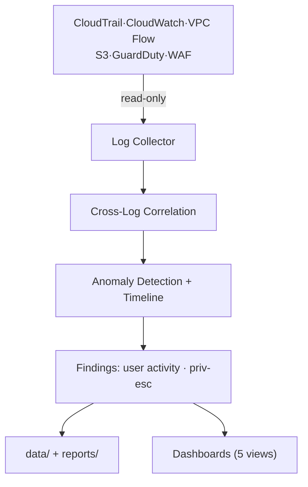
```mermaid
flowchart TD
    A["CloudTrail·CloudWatch·VPC Flow<br/>S3·GuardDuty·WAF"] -->|read-only| B["Log Collector"]
    B --> C["Cross-Log Correlation"]
    C --> D["Anomaly Detection + Timeline"]
    D --> E["Findings: user activity · priv-esc"]
    E --> F["data/ + reports/"]
    E --> G["Dashboards (5 views)"]
```

---

## 6. Offensive Security & Risk

### pentest

*An autonomous offensive-security platform that orchestrates a fleet of specialized attack agents the way a red-team lead directs operators. Reconnaissance, exploitation, and evidence validation run in parallel, and every finding is adversarially re-checked before it reaches the report.*
**Purpose** — Multi-agent penetration-testing framework orchestrating parallel recon, vulnerability testing, and evidence validation across 50+ attack types and 11 domains.
**Inputs / data sources** — User-defined target scope + explicit authorization; optional Shodan/DNS intel; Modal OIDC for AWS.
**How it works** — **Initialization** (coordinator parses scope, loads 20+ skills) → **Reconnaissance** (parallel discovery agents) → **Planning** (batch attack vectors by surface) → **Vulnerability Testing** (stateless executor agents write finding-NNN artifacts) → **Aggregation & Validation** (validator agents run 5 checks: CVSS consistency, evidence, PoC, claims-vs-raw, log corroboration) → **Reporting** (dashboard + branded PDF + remediation roadmap).
**Agents & skills** — Coordinator (inline), Executor (background, stateless), Validator (background, per-finding); 25+ skills (injection, client/server-side, auth, api-security, cloud-containers, ai-threat-testing, cve-poc-generator, osint, dfir, …).
**Outputs** — Validated findings (CVSS/CWE/OWASP/MITRE), `PentestReportDashboard.tsx`, `pentest_results.json`, Transilience PDF, NDJSON logs.
**Frameworks** — OWASP Top 10 / WSTG / LLM Top 10, MITRE ATT&CK, PTES, CWE, CVSS v3.1, NIST SP 800-115.

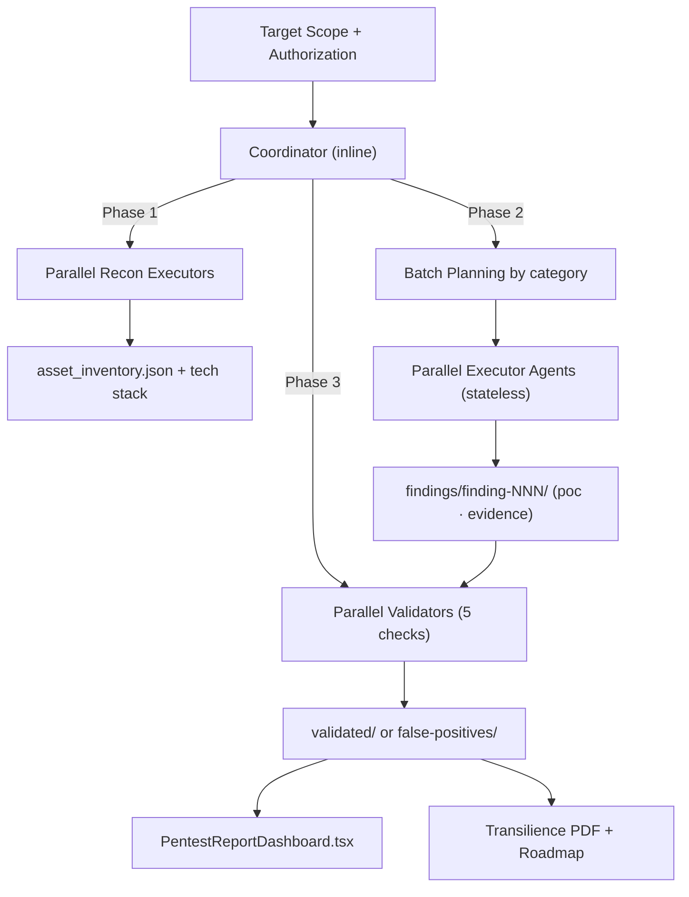
```mermaid
flowchart TD
    Scope["Target Scope + Authorization"] --> Coord["Coordinator (inline)"]
    Coord -->|Phase 1| Recon["Parallel Recon Executors"]
    Recon --> Inv["asset_inventory.json + tech stack"]
    Coord -->|Phase 2| Plan["Batch Planning by category"]
    Plan --> Exec["Parallel Executor Agents (stateless)"]
    Exec --> Find["findings/finding-NNN/ (poc · evidence)"]
    Coord -->|Phase 3| Val["Parallel Validators (5 checks)"]
    Find --> Val
    Val --> VOK["validated/ or false-positives/"]
    VOK --> Dash["PentestReportDashboard.tsx"]
    VOK --> PDF["Transilience PDF + Roadmap"]
```

### cloud-attack-path-analysis

*A graph-based way to think like an attacker about your own cloud. It chains misconfigurations, vulnerabilities, and access into ranked attack paths, then pinpoints the single fixes—chokepoints—that collapse the most routes at once.*
**Purpose** — Discover and visualize attack paths through cloud infrastructure, score them by probability, and identify chokepoint remediations.
**Inputs / data sources** — EC2, IAM, S3, RDS, VPC, Security Hub, GuardDuty, Inspector, CloudTrail, Access Analyzer.
**How it works** — Profile infrastructure → detect misconfigurations + map IAM privilege-escalation paths → correlate vulnerabilities to resources (CVSS/EPSS/KEV) → analyze network paths internet→internal → build attack graph (resources=nodes, vectors=edges) → score each path (exploitability 30 / exposure 25 / misconfig 20 / detection 15 / frequency 10) → find chokepoints breaking many paths at once.
**Agents & skills** — `cloud-attack-path-analysis-agent`, `aws_credential_manager`; `cloud-attack-path-analysis-skill`.
**Outputs** — `attack_paths/attack_graph/chokepoints.json`, MITRE-mapped reports, `AttackPathDashboard.tsx` + interactive `AttackGraphVisualization`.
**Frameworks** — PCI-DSS 6.1/11.3, CIS AWS 1–4.x, NIST RA-5/CA-8, MITRE ATT&CK.

```mermaid
flowchart TD
    A["EC2·IAM·S3·RDS·VPC"] --> B["Infrastructure Profiler"]
    C["Security Hub·GuardDuty·Inspector"] --> B
    D["CloudTrail·Access Analyzer"] --> B
    B --> E["Misconfig Detector"]
    B --> F["Privilege-Escalation Analyzer"]
    B --> G["Vulnerability Correlator (CVSS/EPSS)"]
    E --> H["Attack Graph Builder"]
    F --> H
    G --> H
    H --> I["Probability Scorer → Chokepoints"]
    I --> J["data/ paths · graph · chokepoints"]
    I --> K["AttackPathDashboard + Graph Viz"]
```

### aws-vulnerability-prioritizer

*A triage layer over ECR and Inspector that answers the only question that matters in vulnerability management—what do we fix first? It weighs exploitability against business context, then projects how much risk each remediation actually removes.*
**Purpose** — Analyze ECR/Inspector vulnerabilities, trace root packages, enrich with asset context, prioritize by risk, and simulate remediation impact.
**Inputs / data sources** — ECR scan findings, Inspector findings, AWS resource tags, image metadata.
**How it works** — Collect ECR + Inspector data → map vulnerabilities to root packages across dependency trees → enrich with tag-derived asset context → prioritize by weighted score (CVSS 30 / EPSS 25 / criticality 20 / exposure 15 / effort 10) → generate action items → simulate before/after vulnerability counts.
**Agents & skills** — `vulnerability-prioritizer-agent`, `aws_credential_manager`; `vulnerability-prioritizer-skill`.
**Outputs** — `vulnerability_findings/root_packages/asset_inventory/remediation_plan/impact_simulation.json`, reports, `VulnerabilityPrioritizerDashboard.tsx`.
**Frameworks** — PCI-DSS 6.2/6.3, CIS AWS 5.1, SOC 2 CC7.1, NIST RA-5.

```mermaid
flowchart TD
    A["ECR Scans"] --> C["Vulnerability Collector"]
    B["Inspector"] --> C
    C --> D["Root Package Tracer"]
    D --> E["Asset Context Enricher (tags)"]
    E --> F["Prioritization Engine (P0–P3)"]
    F --> G["Impact Simulator (before/after)"]
    F --> H["data/ + reports/"]
    G --> I["VulnerabilityPrioritizerDashboard.tsx"]
```

### threat-radar-generation

*A passive reconnaissance pipeline that fingerprints an organization's technology stack from public signals alone, then renders a tailored threat radar. No credentials, no active scanning—pure OSINT inference.*
**Purpose** — Two-stage passive OSINT: infer an organization's technology stack via 26 reconnaissance skills, then render a personalized threat radar.
**Inputs / data sources** — Company name (+ optional domain); passive sources only — DNS, HTTP headers, TLS certs, JS DOM, HTML metadata, GitHub, job posts, web archives, CT logs.
**How it works** — **Stage 1**: asset discovery → data collection (fingerprinting/intel) → tech inference (frontend/backend/cloud/CDN/WAF/security/DevOps) → correlation (confidence scoring, conflict resolution) → report. **Stage 2**: build customer profile → call radar API (20-min timeout) → process result → generate `RadarDashboard_<id>.tsx`.
**Agents & skills** — Stage 1 `stage_1_agent` (5 sub-agents, 26 skills); Stage 2 `stage_2_agent` (profile builder, radar API caller, result processor, component generation).
**Outputs** — `techstack_report.json` (tech + confidence + evidence), `RadarDashboard_<id>.tsx`, `customer_profile.json`, `radar_output.json`, JSONL logs.
**Frameworks** — None (pure OSINT discovery).

```mermaid
flowchart TD
    In["Company Name + Domain"] --> S1["Stage 1 (26 skills)"]
    S1 --> AD["Asset Discovery"]
    AD --> DC["Data Collection (fingerprint·intel)"]
    DC --> TI["Tech Inference"]
    TI --> CO["Correlation (confidence·conflict)"]
    CO --> RG["techstack_report.json"]
    RG --> S2["Stage 2"]
    S2 --> PR["Customer Profile"]
    PR --> API["Radar API (20-min)"]
    API --> RC["Radar Component Gen"]
    RC --> RD["RadarDashboard_&lt;id&gt;.tsx"]
```

---

## 7. Network & Infrastructure

### network-diagram-curator

*An always-current map of the cloud network, generated from the live account rather than stale Visio files. It produces interactive topology, a searchable asset inventory with end-of-life tracking, and PCI scope visualizations.*
**Purpose** — Collect AWS infrastructure via boto3 and generate interactive topology diagrams, asset inventory with EOL tracking, and PCI scoping visualizations.
**Inputs / data sources** — EC2, RDS, Lambda, CloudTrail, CloudWatch, API Gateway, S3, ElastiCache, WAF; VPCs, subnets, SGs, route tables, NACLs, peering, TGWs; OS/engine versions for EOL.
**How it works** — SessionStart hook runs `run_pipeline.py` → `collect_aws_data.py` fetches infra → copy `.tsx` templates to `outputs/components/` → embed real data as `defaultData`, compile TSX→JS via esbuild with security validation → emit three components: NetworkTopologyDiagram (ReactFlow, SVG/JSON export), AssetInventoryTable (vendor/firmware/EOL, searchable), InteractiveScopingDiagram (PCI CDE/connected/security-impacting/out-of-scope).
**Agents & skills** — No agents; `network-diagram-curator` skill; `dashboard-creation-skill`, `interactive-user-actions`, `platform-api`; hooks `session-start-credentials`, `update-imports`.
**Outputs** — 3 compiled TSX/JS components, `aws_infrastructure.json`, `task_results.json`, `flow.json`, EOL markdown, PNG/SVG diagrams.
**Frameworks** — PCI DSS (CDE scoping), AWS Well-Architected.

```mermaid
flowchart TD
    A["SessionStart → run_pipeline.py"] --> B["collect_aws_data.py (boto3)"]
    B --> C["aws_infrastructure.json"]
    C --> D["Copy .tsx templates"]
    C --> E["Embed defaultData"]
    E --> F["esbuild compile + security validate"]
    F --> G["NetworkTopologyDiagram.js"]
    F --> H["AssetInventoryTable.js"]
    F --> I["InteractiveScopingDiagram.js"]
    C --> J["task_results.json + flow.json"]
```

### network-ruleset-review

*An automation of the annual firewall review that PCI mandates and most teams dread. It normalizes AWS and appliance rulesets alike, AI-annotates each rule's risk, and emits a formal Word report.*
**Purpose** — PCI-DSS v4.0 annual network ruleset review merging NACL, Security Group, VPC architecture, and firewall-export analysis into a Word report.
**Inputs / data sources** — `describe_network_acls`/`describe_security_groups`, VPC + route tables; firewall exports (Palo Alto, Fortinet, Cisco ASA — CSV/JSON/text); rule justifications.
**How it works** — SessionStart `bootstrap_dashboard.py` runs `collect_aws_data.py` → `ruleset_analysis.json` with normalized rules + baseline risk → dashboard offers three review modes (NACL / firewall+SG / combined) → user picks; browser filters by review_type, calls `/ai-bridge/invoke` once for PCI commentary, computes score → `/project/execute` with `persist_only` + file attachments → agent persists, copies TSX, runs `write_report.py` (`report-writer` skill) to generate a 14-section branded DOCX.
**Agents & skills** — `network-ruleset-review-agent`; `network-ruleset-review` skill; shared `report-writer` (DOCX, Transilience design system); `dashboard-creation-skill`, `interactive-user-actions`, `platform-api`.
**Outputs** — `ruleset_analysis.json`, `task_results.json`, dashboard TSX, `{Company}_Annual_Network_Ruleset_Review_{Date}.docx` (14 sections, PCI mapping, sign-off).
**Frameworks** — PCI-DSS v4.0 1.1.7 / 1.2 / 1.3 / 1.4.

```mermaid
flowchart TD
    A["SessionStart: bootstrap_dashboard.py"] --> B["collect_aws_data.py"]
    B --> C["ruleset_analysis.json (normalized + baseline risk)"]
    D["Dashboard"] --> C
    D --> E["Review Mode: NACL / SG / Combined"]
    E --> F["Browser filter + classify"]
    F --> G["/ai-bridge/invoke (PCI commentary)"]
    G --> H["Score in browser"]
    H -->|/project/execute persist_only| I["Agent persists + copies TSX"]
    I --> J["write_report.py (report-writer)"]
    J --> K["Annual Review DOCX (14 sections)"]
```

### devops-security-remediation

*A fast-acting fix for the most common critical cloud misconfiguration—security groups open to the entire internet. It finds them, ranks them by exposure, and writes both the remediation and the rollback scripts.*
**Purpose** — Identify security groups with 0.0.0.0/0 ingress and generate remediation + rollback scripts.
**Inputs / data sources** — EC2 security groups, network interfaces, running instances; credentials via hook.
**How it works** — Retrieve credentials → discover all 0.0.0.0/0 ingress rules → classify severity (CRITICAL: SSH/RDP/DB; MEDIUM: HTTP; LOW: HTTPS) → impact analysis (affected EC2/RDS/ELB) → generate Python remediation + rollback scripts → dashboard with findings and action buttons.
**Agents & skills** — No agents; `security-group-remediation` skill; `dashboard-creation-skill`, `platform-api`.
**Outputs** — `remediate_*/rollback_*/batch_remediate.py` scripts, `wide_open_sgs.json`, `risk_assessment.json`, `remediation_report.md`.
**Frameworks** — SOC 2.

```mermaid
flowchart TD
    A["EC2 Security Groups"] --> B["Find 0.0.0.0/0 Rules"]
    C["session-start-credentials"] --> B
    B --> D["Severity Classify + Impact (EC2/RDS/ELB)"]
    D --> E["data/ wide_open_sgs · risk_assessment"]
    B --> F["Generate scripts<br/>remediate · rollback · batch"]
    E --> G["RemediationDashboard.tsx"]
    F --> H["DevOps executes remediation"]
```

---

## 8. FinOps

### cloud-cost-monitor

*A FinOps assistant that treats wasted spend as a first-class finding. It combines right-sizing, commitment optimization, and anomaly detection to recover budget and catch cost-driven abuse such as cryptomining.*
**Purpose** — Monitor AWS cost, recommend right-sizing, optimize RI/Savings Plan commitments, and detect cost anomalies.
**Inputs / data sources** — Cost Explorer, Compute Optimizer, CloudWatch metrics, Budgets, Trusted Advisor.
**How it works** — Query Cost Explorer (trends, forecast, breakdown, anomalies) → Compute Optimizer right-sizing (EC2/RDS/ElastiCache/Lambda/EBS) → analyze RI utilization + model Savings Plans → detect anomalies (crypto-mining spikes, data-transfer, storage growth, zombies) → break-even analysis → prioritize remediation by savings (30–70%).
**Agents & skills** — `cloud-cost-monitor-agent`, `aws_credential_manager`; `cloud-cost-monitor-skill`.
**Outputs** — `cost_summary/rightsizing/ri_sp/anomalies/budget_status.json`, reports, 5 TSX views (CostMonitor, RightSizing, SavingsPlan, AnomalyDetection, BudgetTracker).
**Frameworks** — FinOps Foundation, AWS Well-Architected COST, ISO 27001 A.12.1, SOC 2 CC6.1.

```mermaid
flowchart TD
    A["Cost Explorer"] --> B["Cost Analyzer"]
    C["Compute Optimizer"] --> B
    D["CloudWatch Metrics"] --> B
    E["Budgets · Trusted Advisor"] --> B
    B --> F["Right-Sizing Engine"]
    B --> G["Commitment Optimizer (break-even)"]
    B --> H["Anomaly Detector (spikes·zombies)"]
    F --> I["Prioritizer by savings"]
    G --> I
    H --> I
    I --> J["data/ + reports/"]
    I --> K["5 TSX Views"]
```

---

## 9. Training & Simulation

### devops-simulation-training

*A flight simulator for cloud-operations teams, letting engineers rehearse incidents in a modeled environment without production risk. Scenarios escalate dynamically and scoring measures genuine response skill.*
**Purpose** — Gamified cloud-infrastructure simulations for DevOps teams to practice incident response, capacity planning, DDoS mitigation, and compliance scenarios.
**Inputs / data sources** — Scenario library (10+ scenarios); user difficulty/mode selections; optional AWS context.
**How it works** — Load scenario library → simulation engine models production architecture (WAF→ALB→Compute→Cache→DB→Storage) with dynamic events + cost tracking → gamified dashboard (briefing, investigation tabs, challenges) → knowledge challenges (MC / text / T-F / priority ordering) → scoring (response/resolution time, impact, cost efficiency, compliance) → AI Bridge dynamic assessment + feedback.
**Agents & skills** — `aws_credential_manager`, `devops-simulation-training-agent`; `devops-simulation-training-skill`, `ai-bridge`; `dashboard-creation-skill`, `interactive-user-actions`, `platform-api`.
**Outputs** — `scenario_library/simulation_results/team_progress/skill_assessment.json`, training reports, `SimulationDashboard.tsx`, `ServerSurvivalDashboard.tsx`.
**Frameworks** — None (custom training).

```mermaid
flowchart TD
    A["Scenario Library (10+)"] --> B["Simulation Engine"]
    C["User: difficulty · mode · budget"] --> B
    D["AWS Context (optional)"] --> B
    B --> E["data/ scenario · results · progress"]
    B --> F["Gamified Dashboard"]
    F --> G["Challenges → /ai-bridge/invoke"]
    G --> H["Dynamic Scoring"]
    B --> I["Training Reports"]
```

### tabletop-exercise

*A generator for disaster-recovery tabletop drills that feel real because they reference your actual infrastructure. It runs role-specific injects, scores participant responses, and maps readiness back to compliance obligations.*
**Purpose** — AI-powered DR tabletop exercise generator producing role-specific scenarios grounded in real AWS inventory.
**Inputs / data sources** — Org inventory from `generate-all-inventory` outputs; user scenario type/roles/objectives; participant responses.
**How it works** — Analyze inventory (critical assets, topology, SPOFs) → generate scenario (ransomware/breach/failure/DDoS/insider/supply-chain/disaster) referencing real infra → execute role-specific questions with escalating injects → AI evaluation across 5 dimensions (technical 30 / completeness 25 / prioritization 20 / communication 15 / compliance 10) → gap analysis + compliance mapping + trends.
**Agents & skills** — `tabletop-exercise-agent`; `tabletop-exercise-skill`; `dashboard-creation-skill`.
**Outputs** — `TabletopExerciseDashboard.tsx` + 5 detail views, scenario/question/response/evaluation JSON, markdown gap report.
**Frameworks** — PCI-DSS v4.0.1 12.4, NIST SP 800-61, ISO 22301, SOC 2 CC7.x.

```mermaid
flowchart TD
    A["generate-all-inventory Outputs"] --> B["Inventory Analysis (SPOFs)"]
    B --> C["Scenario Generation (real infra)"]
    C --> D["Exercise Execution (role questions + injects)"]
    D --> E["AI Evaluation (/ai-bridge/invoke, 5 dims)"]
    E --> F["data/ scenarios · responses · evaluations"]
    F --> G["TabletopExerciseDashboard + 5 views"]
    E --> H["Gap Report + Compliance Mapping"]
```

### phishing-simulator

*A gamified awareness academy that teaches phishing and AI-era attack recognition through play rather than lecture. Streaks, lives, and rank badges turn a compliance checkbox into something people actually finish.*
**Purpose** — Gamified phishing-awareness academy: 8 chapters on email detection, header forensics, AI attack vectors, URL classification, perimeter security, and prompt injection.
**Inputs / data sources** — Hardcoded curriculum (8 chapters, 18 challenges); user quiz/drag-drop interactions; scoring engine.
**How it works** — Load curriculum with comic narrative → progress chapters (DMARC/DKIM/SPF header analysis, URL classification with typosquatting/homoglyphs, MC/multi-select quizzes, drag-and-drop URL sorting) → scoring (points + streak bonuses + penalties) → 3-lives system → final rank badge (Gold/Silver/Bronze/Cadet) + certificate → persist via `/project/execute`.
**Agents & skills** — No agents; standalone TSX using `dashboard-creation-skill` + `interactive-user-actions`.
**Outputs** — `PhishBusterAcademyDashboard.tsx`, `task_results.json` (curriculum + scoring rules), completion certificate.
**Frameworks** — None formal (maps loosely to SOC 2 CC7.x security awareness).

```mermaid
flowchart TD
    A["User Launches"] --> B["PhishBusterAcademy (TSX)"]
    B --> C["8-Chapter Navigation"]
    C --> D["Quiz Engine (single · multi · drag-drop)"]
    D --> E["Scoring (points · streaks · penalties)"]
    E --> F["3-Lives Tracking"]
    F --> G["Rank Badge (Gold→Cadet)"]
    G -->|/project/execute| H["Completion + Certificate"]
```

---

## 10. Hub & Framework

### security-dashboard-hub

*The single pane of glass over the entire suite, aggregating every project's output into a role-aware posture view. Executives, managers, and analysts each see the slice they need, backed by a natural-language query box.*
**Purpose** — Role-based aggregation hub visualizing security posture from all projects, with AI Bridge for custom queries and on-demand analysis.
**Inputs / data sources** — Aggregated outputs from all project folders; AWS environment via session creds; user role (CISO / InfoSec Manager / Analyst / Developer).
**How it works** — Load aggregated `dashboard_data.json` → role selection auto-populates preset widgets → natural-language query → `/ai-bridge/invoke` returns a structured widget (metric/list/table/status) → dynamic Recharts rendering → AI Assistant panel answers posture questions with context.
**Agents & skills** — No agents; `dynamic-dashboard` + `platform-api`; AI Bridge for widget gen + Q&A.
**Outputs** — `SecurityDashboardHub.tsx`, `CISODashboard.tsx`, `CustomizeDashboard.tsx`; posture score, KPI cards, 30-day trends, compliance heatmaps, remediation roadmap.
**Frameworks** — PCI-DSS, ISO 27001, SOC 2, HIPAA (aggregated from child projects).

```mermaid
flowchart TD
    P["MCS Platform"] --> AG["Aggregated data/dashboard_data.json"]
    U["User: Role Select"] --> D["SecurityDashboardHub.tsx"]
    AG --> D
    D --> K["Preset Widgets (posture · findings · compliance)"]
    D -->|NL query| W["/ai-bridge/invoke (widget gen)"]
    W --> R["Render Recharts widget"]
    D -->|question| AS["AI Assistant (posture Q&A)"]
    K --> F["Role-specific Dashboard"]
    R --> F
    AS --> F
```

### custom-task

*A general-purpose scaffold for one-off requests that don't warrant a dedicated app. It classifies the user's intent and spins up a matching dashboard on the fly.*
**Purpose** — Flexible framework for executing ad-hoc user queries and dynamically generating matching dashboards.
**Inputs / data sources** — User task intent + query parameters; credentials via hook.
**How it works** — Classify intent (inventory/metrics/security/analysis/form) → collect data by type → generate the matching TSX dashboard → for form tasks, handle submission via `interactive-user-actions` → AI Bridge for dynamic content → persist results, load via fetch.
**Agents & skills** — No agents; `dashboard-creation-skill`, `interactive-user-actions`, `ai-bridge`, `platform-api`.
**Outputs** — `[Task]Dashboard.tsx`, `task_results.json`, `session_metadata.json`.
**Frameworks** — None (general-purpose).

```mermaid
flowchart TD
    A["User Query / Intent"] --> B["Task Classifier"]
    C["session-start-credentials"] --> D["Data Collection"]
    B --> D
    D --> E["task_results.json"]
    E --> F["dashboard-creation-skill"]
    F --> G["[Task]Dashboard.tsx"]
    B -->|form intent| H["interactive-user-actions → /project/execute"]
    H --> E
```

### Updated_evidence_review
**Status** — Empty placeholder. Directory contains only `.DS_Store` and an empty `outputs/` — no `CLAUDE.md`, `project.json`, agents, skills, or source. Likely superseded by [evidence-reviewer](#evidence-reviewer) / [pci-dss-evidence-analyzer](#pci-dss-evidence-analyzer).

---

*Generated from `projects/*/CLAUDE.md` and `project.json`. Diagrams are Mermaid — render in any Mermaid-aware viewer (GitHub, VS Code, Obsidian).*
