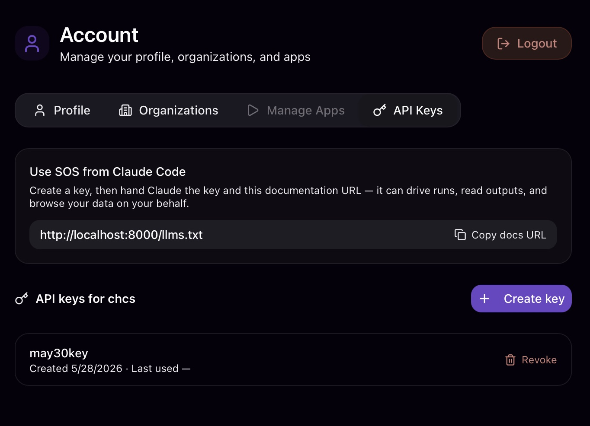

# API keys

## What they are

An **API key** is a long-lived credential that lets a program — for example a coding agent like Claude Code, a script, or `curl` — call the Transilience.ai API on your behalf, without signing in through the browser. With a key, anything you can do from the app (run [apps](apps.md), read [sessions](sessions.md) and [outputs](outputs.md), browse [artifacts](artifacts.md), and more) can be done from the command line or an agent.

Each key is **bound to one [organization](#org-binding)** — the org you were in when you created it. The key carries that org with it, so requests made with the key are automatically scoped to it.



## Where to find them

Open **Settings** from the bottom of the left sidebar, then the **API Keys** tab. You'll see:

- A short "Use SOS from Claude Code" panel with the **documentation URL** to hand to an agent (a `/llms.txt` guide).
- A **Create key** button.
- The list of keys for the current organization, each with its name, when it was created, and when it was last used.

## Creating a key

1. Click **Create key** and give it a name (for example `claude-code-laptop`).
2. The **secret is shown once**, right after creation. Copy it immediately and store it somewhere safe (a password manager) — for security it is never shown again and cannot be retrieved later.
3. If you lose a secret, just **revoke** the key and create a new one.

## Using a key

Send the key as a bearer token on every request:

```
Authorization: Bearer <YOUR_API_KEY>
```

Because the key is bound to an organization, you do **not** send any organization header — the org comes from the key. For a full walkthrough with `curl`, see [use the API](../workflows/use-the-api.md).

## <a id="org-binding"></a>Organization binding

A key belongs to exactly one organization. If you work across several orgs, create one key per org. To act in a different org, switch organizations in the app first, then create a key there.

## Revoking a key

In the **API Keys** tab, click **Revoke** next to a key. Revoked keys stop working shortly afterward and cannot be restored. Revoke a key any time you suspect its secret has leaked, or when a script that used it is retired.

## Common questions

**"Where is the key after I create it?"** — The secret appears only in the one-time dialog right after creation. The list afterward shows the key's name and dates, never the secret. If you didn't copy it, revoke the key and create a new one.

**"Do I need to send my organization with each request?"** — No. The key is tied to one org, so the org is implied.

**"What can a key do?"** — The same things you can do in that org. Admin-only actions still require that you are an org admin.

**"How do I point an AI agent at the API?"** — Give it the documentation URL shown in the API Keys panel (the `/llms.txt` guide) plus a key. See [use the API](../workflows/use-the-api.md).

## Related

- [Use the API](../workflows/use-the-api.md) — step-by-step with curl examples.
- [Sessions](sessions.md) — what a run is, and the IDs you'll see in API responses.
- [Outputs](outputs.md) — the files a run produces, which you can fetch over the API.
