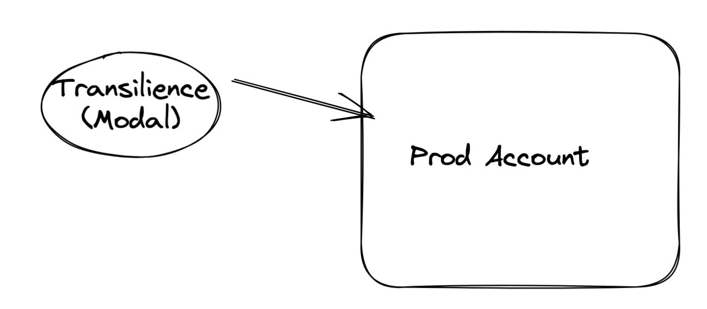
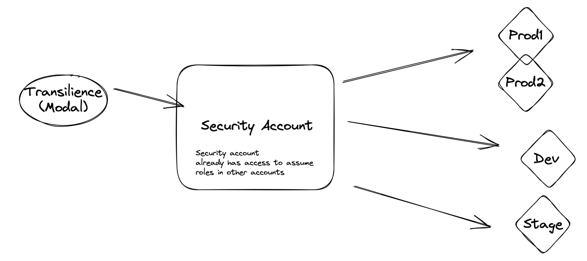
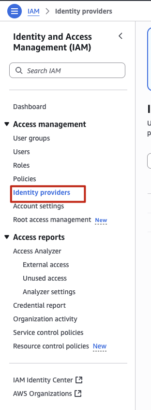
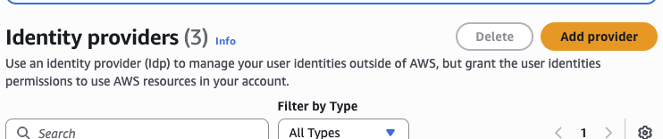
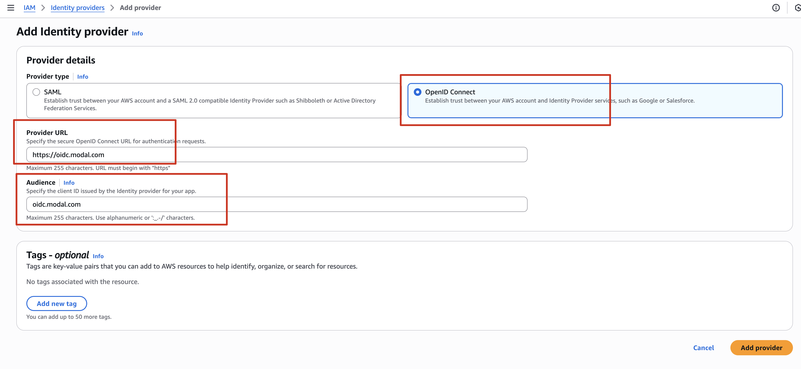
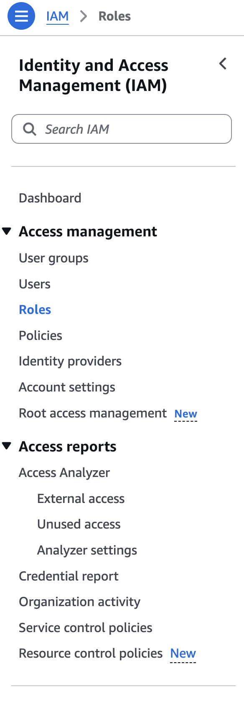
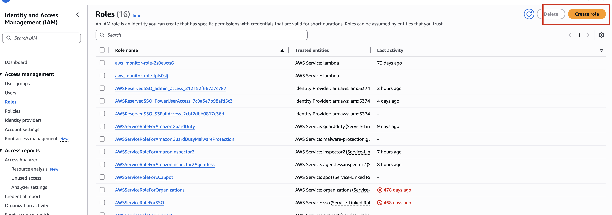
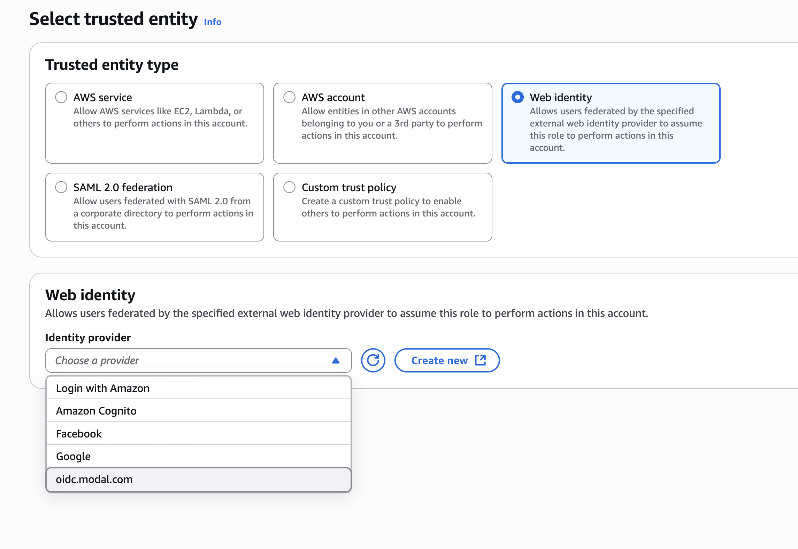
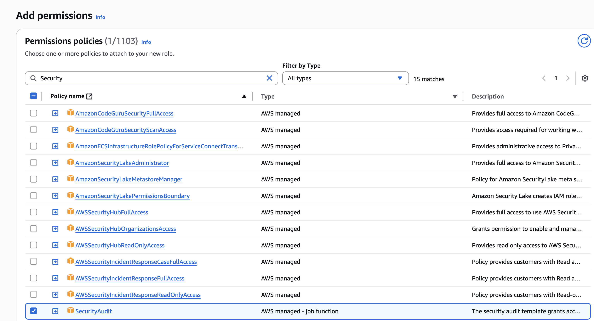
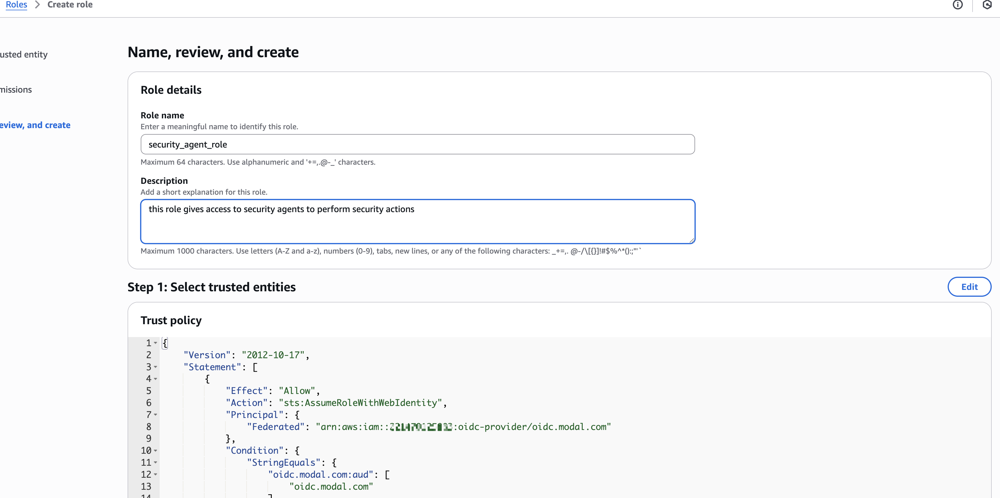

# Manually connect AWS to Transilience Managed Compliance

This guide describes the manual AWS console procedure for connecting one or
more AWS accounts to **Transilience Managed Compliance** with OpenID Connect
(OIDC). It is the portal-based alternative to the preferred
[guided AWS installer](https://www.transilience.ai/install/aws/) and
[AWS CloudFormation installation](aws-cloudformation.md).

The connection uses short-lived, workload-identity credentials issued through
Modal's OIDC provider. Do not create an IAM user, access key, or long-lived AWS
credential for Transilience.

## Resulting access model

The completed setup provides:

- an AWS IAM OIDC identity provider for `https://oidc.modal.com`;
- a dedicated IAM role named `TransilienceManagedCompliance` or another
  customer-approved name;
- a trust policy limited to the Modal audience and Transilience-approved Modal
  workspace IDs;
- the AWS-managed `SecurityAudit` policy for read-only security and
  configuration evidence; and
- the AWS-managed `AmazonEC2ContainerRegistryReadOnly` policy for read-only ECR
  evidence not covered by `SecurityAudit`.

No AWS access key or secret access key is exchanged. Modal functions receive a
short-lived signed identity token and exchange it for temporary AWS role
credentials.

## Before you start

Confirm the following with the customer and Transilience:

- the standalone AWS account, central security account, or AWS Organizations
  accounts that are in scope;
- whether the central security account already has approved cross-account audit
  roles into every in-scope member account;
- the IAM role name to create;
- the current Transilience-approved Modal workspace IDs and any required
  environment, app, or function restrictions; and
- whether ECR evidence is required.

The administrator performing the setup must be allowed to create an IAM OIDC
provider, create and update IAM roles and trust policies, and attach the
approved permission policies.

Do not copy workspace IDs from an old ticket or screenshot. Obtain the current
reviewed values from Transilience for this connection.

> **Screenshot note:** The AWS console screenshots below are navigation aids.
> AWS may change labels or layout. Follow the written field names and use the
> customer-specific account IDs, role names, and workspace IDs supplied for the
> current connection; do not copy example values visible in a screenshot.

## 1. Select the account model

Choose one of these patterns before creating the role.

### Standalone account

Create the OIDC provider and Transilience role in the account being assessed.



### Role in every in-scope organization account

Create the same OIDC provider and dedicated role in every in-scope member
account. This provides explicit account-by-account access and is usually the
simplest organization-wide pattern to review.

### Central security account with cross-account audit roles

Use a role in the central security account only when that account already has
approved audit roles into all in-scope member accounts.



In this pattern:

1. Create the OIDC provider and `TransilienceManagedCompliance` role in the
   central security account.
2. Add a customer-managed policy to that role allowing `sts:AssumeRole` only
   for the named member-account audit-role ARNs.
3. In every member account, confirm that its audit role trusts the central
   `TransilienceManagedCompliance` role.
4. Attach `SecurityAudit` and, when required,
   `AmazonEC2ContainerRegistryReadOnly` to each member audit role.

Do not use wildcard account or role resources for cross-account access. List
the approved member-role ARNs explicitly.

## 2. Create the Modal OIDC identity provider

In each account where the Transilience role will be created:

1. Open the AWS console and go to **IAM → Identity providers**.

   

2. Select **Add provider**.

   

3. Choose **OpenID Connect**.
4. Enter `https://oidc.modal.com` as the provider URL.
5. Enter `oidc.modal.com` as the audience.

   

6. Retrieve the provider information and add the provider.
7. Verify that the resulting provider ARN is:

   ```text
   arn:aws:iam::<AWS_ACCOUNT_ID>:oidc-provider/oidc.modal.com
   ```

AWS reads Modal's OIDC discovery document and signing keys from:

```text
https://oidc.modal.com/.well-known/openid-configuration
```

If the provider already exists, review and reuse it rather than creating a
duplicate.

## 3. Create the Transilience IAM role

1. In IAM, open **Roles → Create role**.

   

   

2. Choose **Web identity** as the trusted entity type.
3. Select the `oidc.modal.com` identity provider.
4. Select `oidc.modal.com` as the audience.

   

5. Add the AWS-managed `SecurityAudit` policy.

   

6. When ECR evidence is required, also add the AWS-managed
   `AmazonEC2ContainerRegistryReadOnly` policy.
7. Name the role `TransilienceManagedCompliance`, or use the customer-approved
   role name.
8. Create the role.

`SecurityAudit` provides broad read-only access to security configuration and
findings, but it does not provide all ECR read operations. The additional ECR
policy closes that evidence gap without granting ECR write access.

## 4. Restrict the role trust policy

Open the new role's **Trust relationships** tab and replace the generated trust
policy with the reviewed customer-specific policy.



Use the following template. Replace the account ID and workspace placeholders
with the values approved for this connection.

```json
{
  "Version": "2012-10-17",
  "Statement": [
    {
      "Sid": "AllowApprovedTransilienceModalWorkspaces",
      "Effect": "Allow",
      "Principal": {
        "Federated": "arn:aws:iam::<AWS_ACCOUNT_ID>:oidc-provider/oidc.modal.com"
      },
      "Action": "sts:AssumeRoleWithWebIdentity",
      "Condition": {
        "StringEquals": {
          "oidc.modal.com:aud": "oidc.modal.com"
        },
        "StringLike": {
          "oidc.modal.com:sub": [
            "modal:workspace_id:<APPROVED_TRANSILIENCE_WORKSPACE_ID_1>:*",
            "modal:workspace_id:<APPROVED_TRANSILIENCE_WORKSPACE_ID_2>:*"
          ]
        }
      }
    }
  ]
}
```

The `aud` condition prevents a token issued for a different audience from
assuming the role. The `sub` condition restricts access to the approved Modal
workspaces. When Transilience supplies narrower environment, app, or function
patterns, use those patterns instead of the workspace-wide wildcard.

Do not remove either condition, use a wildcard-only subject, or trust an AWS
principal belonging to Transilience in place of the reviewed OIDC provider.

## 5. Configure multi-account access when required

Skip this section for a standalone account or when the OIDC role is created in
every in-scope account.

For a central security-account pattern, attach a customer-managed policy like
the following to the central `TransilienceManagedCompliance` role:

```json
{
  "Version": "2012-10-17",
  "Statement": [
    {
      "Sid": "AssumeApprovedMemberAuditRoles",
      "Effect": "Allow",
      "Action": "sts:AssumeRole",
      "Resource": [
        "arn:aws:iam::<MEMBER_ACCOUNT_ID_1>:role/<AUDIT_ROLE_NAME_1>",
        "arn:aws:iam::<MEMBER_ACCOUNT_ID_2>:role/<AUDIT_ROLE_NAME_2>"
      ]
    }
  ]
}
```

Each member audit role must have a trust-policy statement that permits the
central role ARN to call `sts:AssumeRole`:

```json
{
  "Version": "2012-10-17",
  "Statement": [
    {
      "Sid": "TrustCentralTransilienceAuditRole",
      "Effect": "Allow",
      "Principal": {
        "AWS": "arn:aws:iam::<SECURITY_ACCOUNT_ID>:role/TransilienceManagedCompliance"
      },
      "Action": "sts:AssumeRole"
    }
  ]
}
```

Review both sides of every cross-account relationship. Permission to call
`sts:AssumeRole` in the security account is not sufficient unless the member
role also trusts the central role.

## 6. Review what the role can and cannot do

The base manual-onboarding role is intended for read-only security assessment.
It can read the configuration and findings exposed by `SecurityAudit` and, when
attached, the ECR resources exposed by
`AmazonEC2ContainerRegistryReadOnly`.

The base role does not allow Transilience to:

- create, update, or delete AWS resources;
- create IAM users, roles, policies, or access keys;
- change security groups, network ACLs, routes, or firewall rules;
- start, stop, or modify compute resources;
- push, tag, or delete ECR images;
- change AWS Organizations configuration;
- assume roles that are not explicitly listed in an approved cross-account
  policy; or
- access an account that does not contain a trusted role path.

If a separate Transilience workflow requires log delivery, artifact writing,
Systems Manager actions, or another write operation, document and approve that
access separately. Do not add write permissions to this security-audit role by
default.

## 7. Validate the connection

Complete this checklist before considering onboarding finished:

- [ ] The intended standalone, security, or member accounts are documented.
- [ ] `oidc.modal.com` exists as an IAM OIDC provider in every account that
      contains the Transilience role.
- [ ] The OIDC provider audience is exactly `oidc.modal.com`.
- [ ] The role trust policy uses the correct customer AWS account ID.
- [ ] The trust policy checks both `oidc.modal.com:aud` and
      `oidc.modal.com:sub`.
- [ ] Only the current Transilience-approved Modal workspace or narrower
      subject patterns are trusted.
- [ ] The `SecurityAudit` policy is attached.
- [ ] `AmazonEC2ContainerRegistryReadOnly` is attached when ECR evidence is in
      scope.
- [ ] Any central-account `sts:AssumeRole` policy lists only approved member
      audit-role ARNs.
- [ ] Every member audit role trusts only the approved central role and has the
      required read-only policies.
- [ ] No IAM user or static AWS access key was created for Transilience.
- [ ] No AdministratorAccess, write-capable, wildcard cross-account, or
      wildcard-only OIDC subject permission was added.

Ask Transilience to test the connection after the checklist is complete.

## 8. Secure handoff

Provide the following non-secret details to the Transilience account manager or
forward-deployed engineer:

- AWS account ID;
- role name and full role ARN;
- whether the role is in a standalone or central security account;
- the in-scope member account IDs and audit-role ARNs, when applicable;
- the approved regions, if the assessment is region-limited; and
- whether ECR evidence is included.

Do not send an AWS access key, secret access key, or session token. None is
required for OIDC onboarding.

## Revocation

To revoke Transilience access:

1. Delete or disable the `TransilienceManagedCompliance` role in every account
   where it was created.
2. Remove the central role from member-account trust policies.
3. Remove any customer-managed cross-account policies created for the
   connection.
4. Delete the `oidc.modal.com` IAM identity provider only after confirming that
   no other approved workload uses it.
5. Ask Transilience to confirm that role assumption now fails.

## Source and reference material

- [AWS CloudFormation installation](aws-cloudformation.md)
- [Manual AWS account onboarding](https://transilience.freshdesk.com/support/solutions/articles/154000227039-onboard-aws-account-for-transilience-managed-compliance)
- [Guided AWS installer](https://www.transilience.ai/install/aws/)
- [Modal OIDC integration](https://modal.com/docs/guide/oidc-integration)
- [AWS IAM OIDC identity providers](https://docs.aws.amazon.com/IAM/latest/UserGuide/id_roles_providers_create_oidc.html)
- [AWS IAM roles for web identity](https://docs.aws.amazon.com/IAM/latest/UserGuide/id_roles_providers_oidc.html)
- [AWS SecurityAudit managed policy](https://docs.aws.amazon.com/aws-managed-policy/latest/reference/SecurityAudit.html)
- [AWS AmazonEC2ContainerRegistryReadOnly managed policy](https://docs.aws.amazon.com/aws-managed-policy/latest/reference/AmazonEC2ContainerRegistryReadOnly.html)
