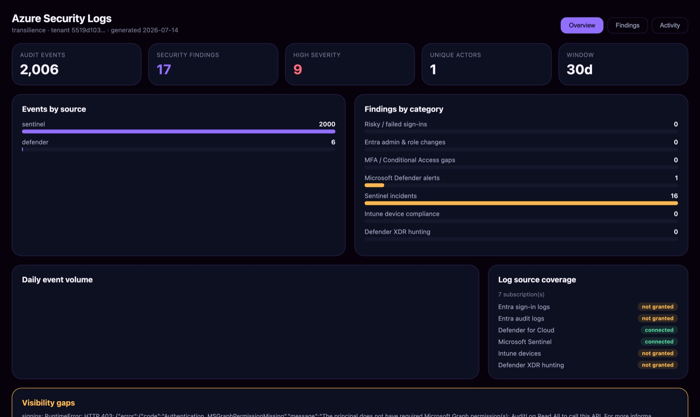

# Azure log monitoring install

Stream your **Microsoft Defender**, **Entra ID**, **Intune**, and **Microsoft Sentinel** logs to
Transilience with a single read-only, admin-approved command in Azure Cloud Shell — then the
**Azure Logs** app turns them into ranked security findings (risky sign-ins, MFA/Conditional-Access
gaps, privileged Entra changes, Defender/Sentinel alerts, non-compliant devices).

This is the self-service replacement for the old manual process (register an app, add each Graph
permission by hand, grant admin consent, then email your Client ID/secret/Tenant ID).

## When this applies

Use this guide whenever a question matches any of these:

- "How do I connect Azure for log monitoring?"
- "Azure log setup" / "onboard Azure logs"
- "How do I monitor Entra / Defender / Sentinel / Intune logs?"
- "How do I run the Azure Logs app?"
- Any question that names Azure logs, Entra ID, Microsoft Defender, Microsoft Sentinel, or Intune
  in the context of connecting or setting up log monitoring.

> For Azure **posture** (CSPM) rather than logs, use the standard Azure connect (the `posture` tier).
> This guide is specifically for **log monitoring** (the `logs` tier).

## What you need

- A **Global Administrator** (or Privileged Role Administrator) — needed once, to consent the
  read-only Entra permissions for your tenant.
- Access to **Azure Cloud Shell** (`shell.azure.com`).
- About 3 minutes. Everything below is **read-only** — nothing is changed, deleted, or sent.

## Connect Azure

1. **Open Integrations and start the Azure connection.** In Transilience, go to **Integrations**,
   find the **Microsoft Azure** row, choose the **Log monitoring** profile, and click **Connect**.
   Transilience generates a one-time command with your connection token baked in.
2. **Open Azure Cloud Shell** (or `shell.azure.com`) and pick **Bash**. Sign in as a Global
   Administrator.
3. **Paste the command from the Integrations page and press Enter.** It runs the read-only installer
   with the `--tier logs` profile:

   ```bash
   curl -sSL https://get.transilience.cloud/azure-compliance.sh | bash -s -- \
     --tier logs --all-subscriptions \
     --complete-url https://onboarding.transilience.cloud/onboarding/azure-complete \
     --external-id <your-one-time-token>
   ```

4. **Let it configure everything.** The script creates a dedicated read-only app, assigns the Azure
   roles, adds and admin-consents the Graph log-monitoring permissions, then registers the
   connection with Transilience — in one pass:

   ```text
   No scope supplied; assessing all 6 accessible subscription(s).
   Created app registration: a1b2c3d4-…-9f8e
   Verified: Reader at /subscriptions/1111…
   Verified: Security Reader at /subscriptions/1111…
   Verified: Log Analytics Reader at /subscriptions/1111…
   Verified: Microsoft Sentinel Reader at /subscriptions/1111…
   Configuring Entra ID (Microsoft Graph) read-only access…
     + Directory.Read.All, AuditLog.Read.All, Policy.Read.All, RoleManagement.Read.Directory
     + User.Read.All, ThreatHunting.Read.All, DeviceManagementManagedDevices.Read.All, Policy.Read.ConditionalAccess
   Entra ID read access granted and admin-consented.
   ✓ Connection registered with Transilience. You can close this window.
   ```

   If you see *"admin consent did not complete"*, the account isn't a Global Admin. Re-run as one, or
   grant consent once in the portal: **App registrations → Transilience Managed Compliance → API
   permissions → Grant admin consent**.

5. **You're connected.** Back in Transilience, the Azure row flips to **Connected** with the
   log-monitoring profile, and it begins ingesting your Defender, Entra, Intune, and Sentinel logs.

## Run the Azure Logs app

Go to **Apps**, choose **Azure Logs**, and click **Continue**. The overview shows events by source,
findings by category and severity, and a **log source coverage** panel (which sources are connected
vs. not yet granted).



## What the command grants

Every role and permission is **read-only** — nothing can change, delete, quarantine, or send.

| Layer | Granted | Covers |
|---|---|---|
| Azure RBAC | `Reader`, `Security Reader` | Resource config; Microsoft Defender for Cloud alerts & secure score |
| Azure RBAC (logs) | `Log Analytics Reader`, `Microsoft Sentinel Reader` | Sentinel incidents & Log Analytics queries |
| Graph (Entra) | `AuditLog.Read.All`, `Directory.Read.All`, `Policy.Read.All`, `RoleManagement.Read.Directory` | Sign-in & audit logs, directory, roles, policies |
| Graph (logs) | `User.Read.All`, `ThreatHunting.Read.All`, `DeviceManagementManagedDevices.Read.All`, `Policy.Read.ConditionalAccess` | Users; Microsoft 365 Defender hunting; Intune devices; Conditional Access |

## Removing access

Click **Disconnect** on the Integrations page, or run the same command with `--uninstall` in Cloud
Shell — it deletes the dedicated app and every role assignment, and Transilience drops the stored
credential.

## Scoping

The one-click assesses every subscription you can access. To narrow it, add
`--subscriptions ID1,ID2` or `--management-group ID`. For posture-only (no log roles), use
`--tier posture`.

## Related

- [Apps](../concepts/apps.md) — what you'll run once Azure is connected.
- [Outputs](../concepts/outputs.md) — the dashboards and reports the app produces.
- [Scheduling](../concepts/scheduling.md) — run the app on a recurring schedule.
