# Manually connect Azure subscriptions, Entra ID, logs, and Defender

This guide combines the manual Azure subscription-onboarding and log-access
procedures into one read-only setup for **Transilience Managed Compliance**. It
also includes the extended Azure RBAC, Microsoft Graph, and Microsoft Defender
for Endpoint access used by the current full-evidence profile.

Use this guide when the customer must configure access manually in the Azure
portal. For the preferred guided installation, use
[Connect Microsoft Azure for a Transilience security audit](azure.md) and the
[Transilience Azure installer](https://www.transilience.ai/install/azure/).

## Resulting access model

The completed setup uses one dedicated, single-tenant Microsoft Entra
application named **Transilience Managed Compliance**. The application:

- acts as itself, without impersonating the administrator who configures it;
- receives read-only Azure RBAC assignments for the approved subscriptions,
  management group, Log Analytics workspaces, and supported resource scopes;
- receives app-only Microsoft Graph and Microsoft Defender for Endpoint
  permissions, with tenant-wide admin consent; and
- uses a time-limited client secret transferred through an approved secure
  handoff channel.

No delegated Microsoft Graph permission, Microsoft Graph `*.ReadWrite.*`
permission, Owner role, or Contributor role is required.

## Before you start

Identify the following before making changes:

- the Microsoft Entra tenant to connect;
- every Azure subscription that Transilience should assess, or the management
  group containing those subscriptions;
- the Log Analytics workspaces and Microsoft Sentinel workspaces that contain
  the required logs;
- any billing scopes that should be reviewed;
- the customer-approved secret lifetime, up to one year; and
- the secure location provided by Transilience for credential handoff.

The administrator or administrators performing the setup must be able to:

- create an app registration and enterprise application in the intended Entra
  tenant;
- grant tenant-wide admin consent for application permissions; and
- assign Azure RBAC roles at every approved scope.

This commonly requires an Entra **Global Administrator** or **Privileged Role
Administrator**, together with **Owner**, **Role Based Access Control
Administrator**, or **User Access Administrator** at the selected Azure scopes.
A customer may divide these duties between two administrators.

> **Screenshot note:** The screenshots below are navigation examples from a
> sample tenant. Azure portal labels and layouts can change. Follow the written
> steps and permission tables in this guide, use the customer's own tenant and
> subscription values, and do not copy the example application names or IDs.

## 1. Create the dedicated application

1. In the Azure portal, open **Microsoft Entra ID → App registrations**.

   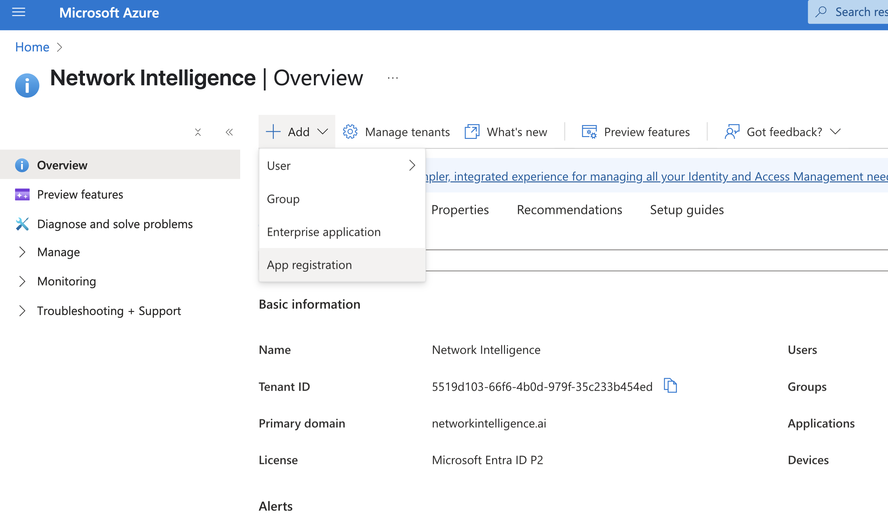

2. Select **New registration**.
3. Enter `Transilience Managed Compliance` as the application name.
4. Select **Accounts in this organizational directory only**.
5. Leave the redirect URI empty and complete the registration.

   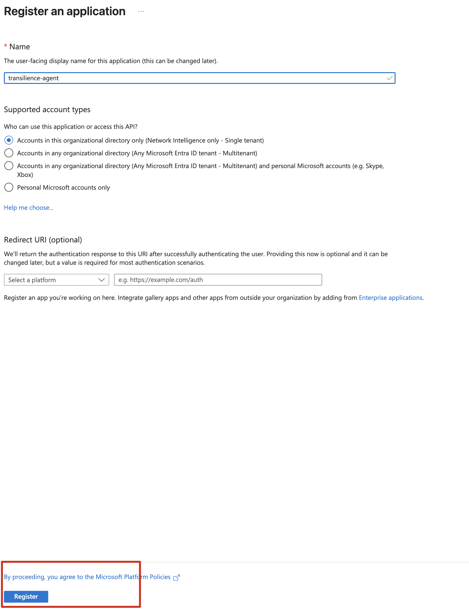

6. On the application's **Overview** page, record the:
   - Application (client) ID; and
   - Directory (tenant) ID.

   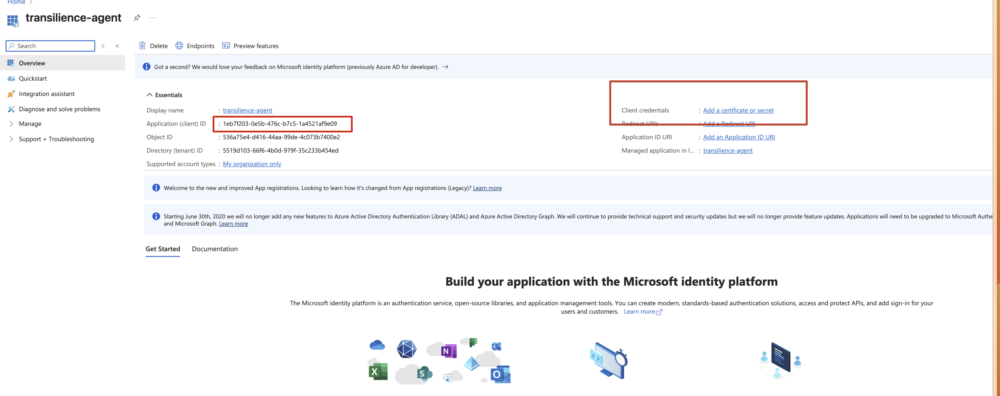

7. Open **Certificates & secrets → Client secrets → New client secret**.
8. Use the customer-approved expiry, up to one year, and create the secret.
9. Copy the secret **value** immediately. It is displayed only once.

   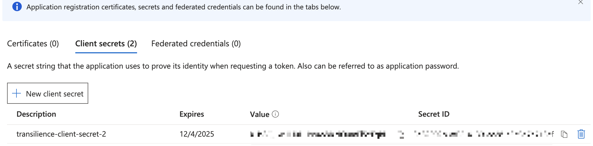

Do not send the secret value by email, chat, or support ticket. Store it only in
the approved secure handoff location described in [Secure handoff](#7-secure-handoff).

## 2. Assign Azure RBAC for subscriptions and resource evidence

Assign the following roles to the application's enterprise service principal.
For a management-group installation, assign the roles at the approved
management group wherever Azure supports that scope. Otherwise repeat the role
assignments for every approved subscription.

| Role | Assignment scope | Why it is needed |
|---|---|---|
| Reader | Selected subscriptions or management group | Inventory resources and read control-plane configuration without changing resources. |
| Security Reader | Selected subscriptions or management group | Read Defender for Cloud recommendations, alerts, policies, and security state. |
| Monitoring Reader | Selected subscriptions or management group | Read Azure Monitor metrics, logs, alerts, and diagnostic settings. |
| Backup Reader | Selected subscriptions or management group | Read backup vaults, protected items, policies, jobs, and backup posture. |
| Key Vault Reader | Selected subscriptions or management group | Read vault and key, secret, and certificate metadata without reading values or key material. |
| Cost Management Reader | Selected subscriptions or management group | Read cost configuration, budgets, exports, and cost-management evidence. |
| Log Analytics Reader | Selected subscriptions, management group, or approved workspaces | Query Log Analytics data and read workspace monitoring configuration. |
| Microsoft Sentinel Reader | Selected subscriptions, management group, or approved workspaces | Read Sentinel incidents, analytics, hunting, and workspace security configuration. |

Add these roles only when the corresponding scope or resource is part of the
assessment:

| Role | Assignment scope | When to use it |
|---|---|---|
| Management Group Reader | Approved management group | Read the management-group hierarchy and included subscriptions. |
| Billing Reader | Explicitly approved billing scopes | Read billing-account and billing-profile evidence. |
| Azure Kubernetes Service RBAC Reader | Each discovered AKS cluster | Read Kubernetes objects needed to assess cluster configuration. |
| App Configuration Data Reader | Each discovered App Configuration store | Read configuration key-values needed for posture checks. |

### Portal assignment steps

For each applicable subscription or management group:

1. Open the scope in the Azure portal.

   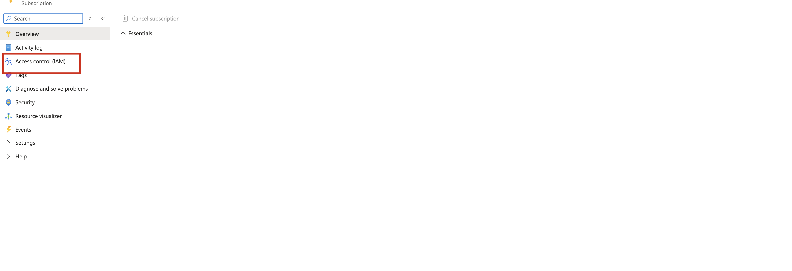

2. Select **Access control (IAM) → Add → Add role assignment**.

   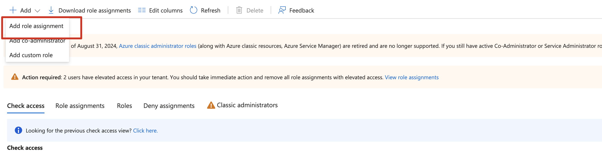

3. Select the required role.

   The following screenshot uses **Reader** as the example. Search for and
   assign each role listed in the tables above; do not infer additional roles
   from the surrounding search results.

   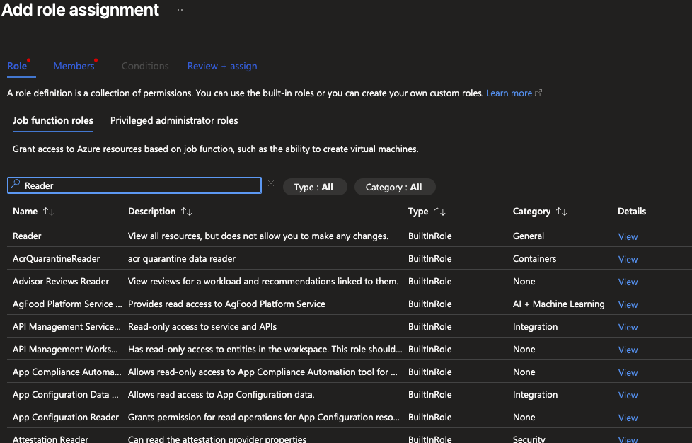

4. Select **User, group, or service principal** as the member type.
5. Find and select **Transilience Managed Compliance**.

   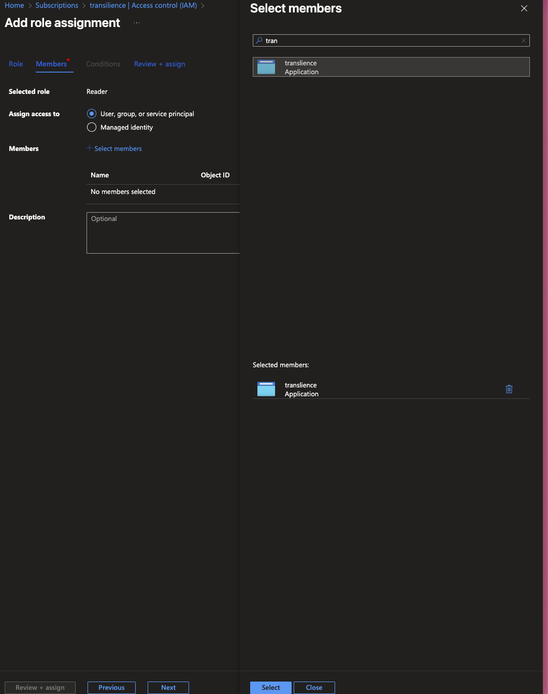

6. Review and assign the role.
7. Repeat until every required role is present at every approved scope.

If Log Analytics or Sentinel access does not inherit from a higher scope,
assign **Log Analytics Reader** and **Microsoft Sentinel Reader** directly on
each approved workspace.

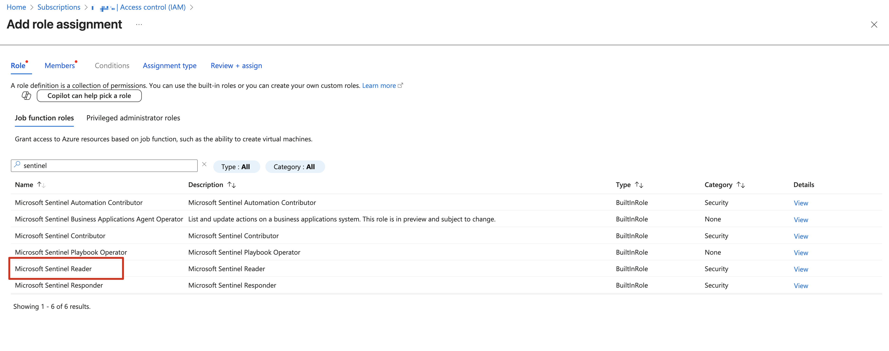

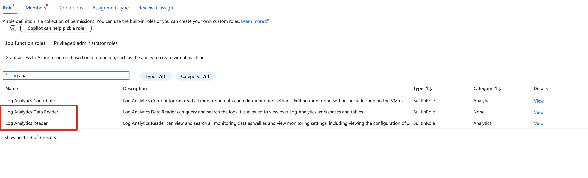

> **Do not assign Reader and Data Access.** The older subscription-onboarding
> article included that role, but the current least-privilege full-evidence
> profile intentionally excludes it, storage `listKeys`, Key Vault secret-value
> roles, and all write-capable Azure roles.

### Record the subscription identifier

On the subscription's **Overview** page, copy its **Subscription ID** for the
secure handoff. Record the **Directory (tenant) ID** from the application
Overview page shown in [Create the dedicated application](#1-create-the-dedicated-application).
Confirm both identifiers belong to the intended customer before continuing.

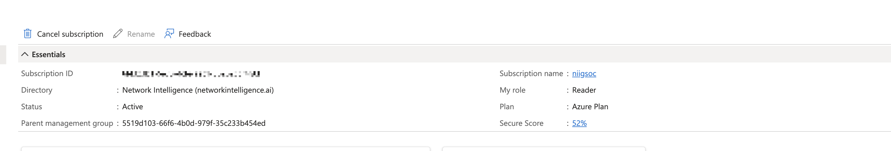

## 3. Add Microsoft Graph application permissions

Open **Microsoft Entra ID → App registrations → Transilience Managed
Compliance → API permissions → Add a permission → Microsoft Graph →
Application permissions**.

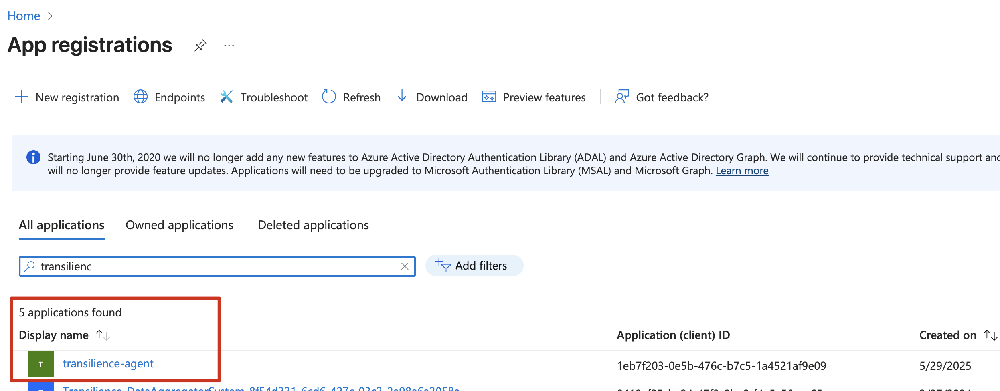

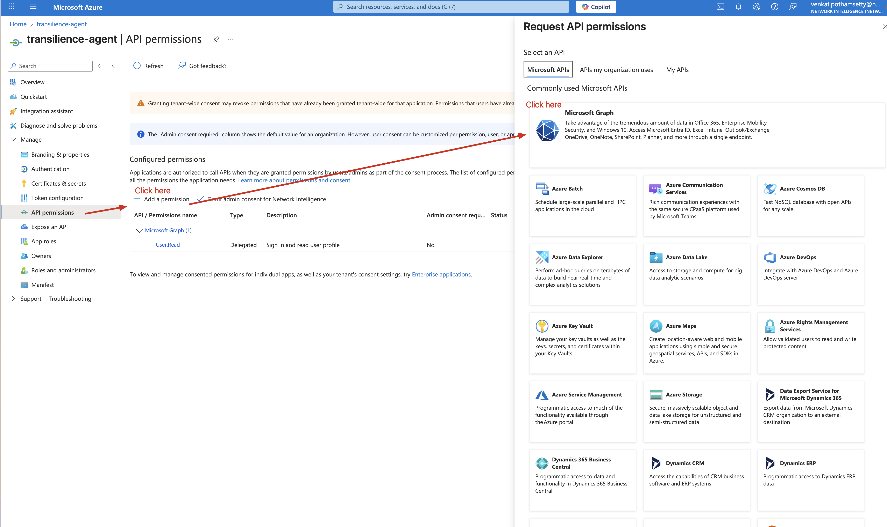

Select **Application permissions**, not **Delegated permissions**, and search
for each exact permission name. A new app registration may display the default
delegated `User.Read` permission; remove it because this integration does not
use delegated access.

Add every permission in the following table. These are tenant-wide,
app-only, read-only permissions.

| Permission | Security and compliance purpose |
|---|---|
| `Directory.Read.All` | Read directory objects and relationships for tenant-wide identity inventory. |
| `User.Read.All` | Inventory users, account state, and identity attributes. |
| `Group.Read.All` | Inventory groups and membership used for access-path analysis. |
| `Application.Read.All` | Inventory app registrations, enterprise applications, credential metadata, and consent configuration. |
| `Device.Read.All` | Inventory Entra-registered devices and trust or compliance attributes. |
| `Organization.Read.All` | Read tenant identity, settings, and verified organization properties. |
| `Domain.Read.All` | Read verified and federated domain configuration. |
| `AdministrativeUnit.Read.All` | Read administrative units and membership or delegation boundaries. |
| `RoleManagement.Read.Directory` | Read Entra role definitions and assignments. |
| `RoleEligibilitySchedule.Read.Directory` | Read eligible Privileged Identity Management role schedules. |
| `RoleAssignmentSchedule.Read.Directory` | Read active and scheduled privileged-role assignments. |
| `RoleManagementPolicy.Read.Directory` | Read PIM activation, approval, duration, and notification policies. |
| `RoleManagement.Read.All` | Read role-management configuration exposed through supported Graph resources. |
| `Policy.Read.All` | Read tenant identity and authorization policies. |
| `Policy.Read.ConditionalAccess` | Read Conditional Access policies and named locations. |
| `Policy.Read.AuthenticationMethod` | Read authentication-method, MFA, and authentication-strength policies. |
| `Policy.Read.PermissionGrant` | Read application consent and permission-grant policies. |
| `Policy.Read.DeviceConfiguration` | Read device registration and authorization policies. |
| `CrossTenantInformation.ReadBasic.All` | Read basic cross-tenant organization information for trust review. |
| `AuditLog.Read.All` | Read directory audit, provisioning, and sign-in activity. |
| `Reports.Read.All` | Read service-usage and security reports. |
| `ReportSettings.Read.All` | Read administrative report settings, including concealed-data settings. |
| `AuditLogsQuery.Read.All` | Query audit-log data exposed across Microsoft services. |
| `AccessReview.Read.All` | Read access reviews, reviewers, decisions, and settings. |
| `EntitlementManagement.Read.All` | Read access packages, catalogs, assignments, and entitlement policies. |
| `LifecycleWorkflows.Read.All` | Read joiner, mover, and leaver workflow configuration and execution history. |
| `Agreement.Read.All` | Read terms-of-use agreements and acceptance records. |
| `OnPremDirectorySynchronization.Read.All` | Read hybrid identity synchronization configuration and status. |
| `SecurityEvents.Read.All` | Read security events exposed through the Microsoft Graph security API. |
| `SecurityAlert.Read.All` | Read security alerts for investigation and control evidence. |
| `SecurityIncident.Read.All` | Read correlated security incidents and their status. |
| `ThreatHunting.Read.All` | Run read-only advanced-hunting queries for security evidence. |
| `IdentityRiskyUser.Read.All` | Read risky-user detections and risk state. |
| `IdentityRiskEvent.Read.All` | Read identity-risk detections and event details. |
| `IdentityRiskyServicePrincipal.Read.All` | Read risk findings for workload identities and service principals. |
| `SecurityActions.Read.All` | Read remediation-action status without initiating actions. |
| `ThreatIndicators.Read.All` | Read tenant threat-intelligence indicators. |
| `InformationProtectionPolicy.Read.All` | Read information-protection policy configuration. |
| `DeviceManagementConfiguration.Read.All` | Read Intune device configuration and compliance policies. |
| `DeviceManagementManagedDevices.Read.All` | Read managed-device inventory, ownership, health, and compliance state. |
| `DeviceManagementApps.Read.All` | Read managed-application inventory and app-management policy. |
| `DeviceManagementServiceConfig.Read.All` | Read Intune tenant and service configuration. |
| `DeviceManagementRBAC.Read.All` | Read Intune roles, assignments, and scope tags. |

Some permissions return evidence only when the corresponding Microsoft product
is licensed and configured. Granting a permission does not create data in a
product that the customer does not use.

The following examples show the selection pattern for representative Graph
permissions. Repeat the same process for every permission in the table above.

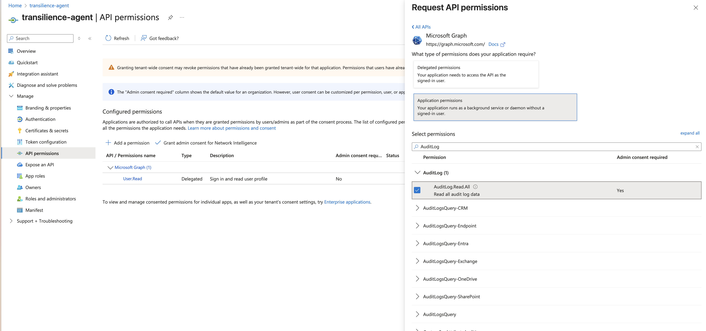

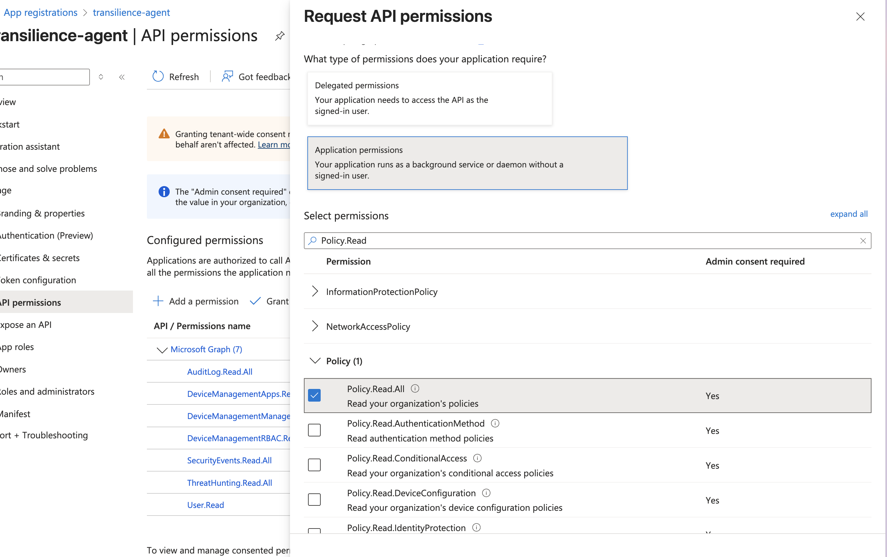

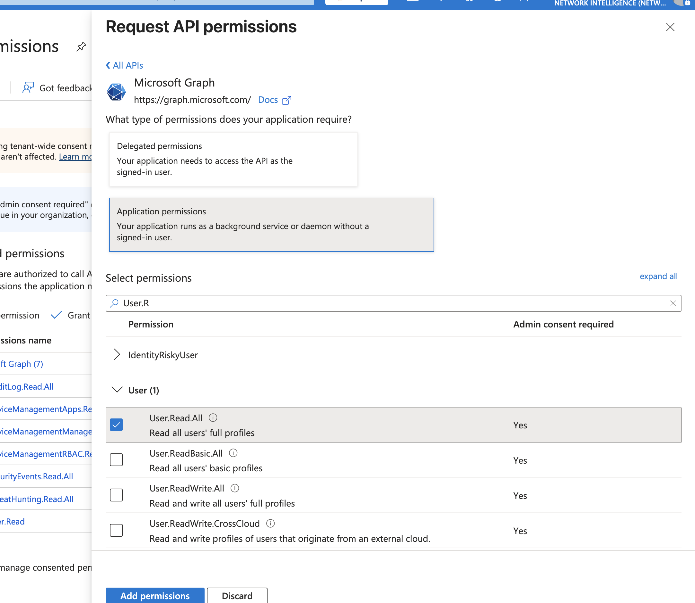

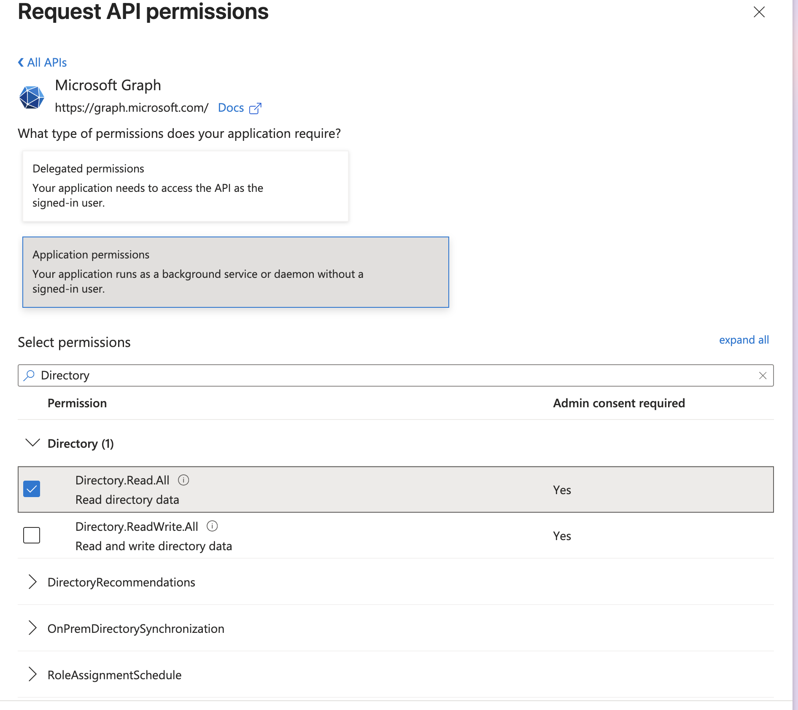

## 4. Add Microsoft Defender for Endpoint application permissions

From **API permissions → Add a permission**, select the Microsoft Defender for
Endpoint API and add these **Application permissions**:

| Permission | Security and compliance purpose |
|---|---|
| `Machine.Read.All` | Read onboarded endpoint inventory, health, exposure, and device details. |
| `Vulnerability.Read.All` | Read discovered vulnerabilities and affected devices. |
| `SecurityRecommendation.Read.All` | Read endpoint recommendations and remediation context. |
| `Software.Read.All` | Read installed-software inventory and software evidence. |
| `Score.Read.All` | Read exposure and security-score evidence. |
| `Alert.Read.All` | Read Defender for Endpoint alerts and investigation context. |

These permissions are app-only and read-only. Evidence is available only when
Microsoft Defender for Endpoint is licensed and configured in the tenant.

## 5. Grant tenant-wide admin consent

1. Return to the application's **API permissions** page.
2. Review the complete Microsoft Graph and Microsoft Defender for Endpoint
   permission list with the customer.
3. Select **Grant admin consent for _tenant name_**.
4. Confirm the action.

   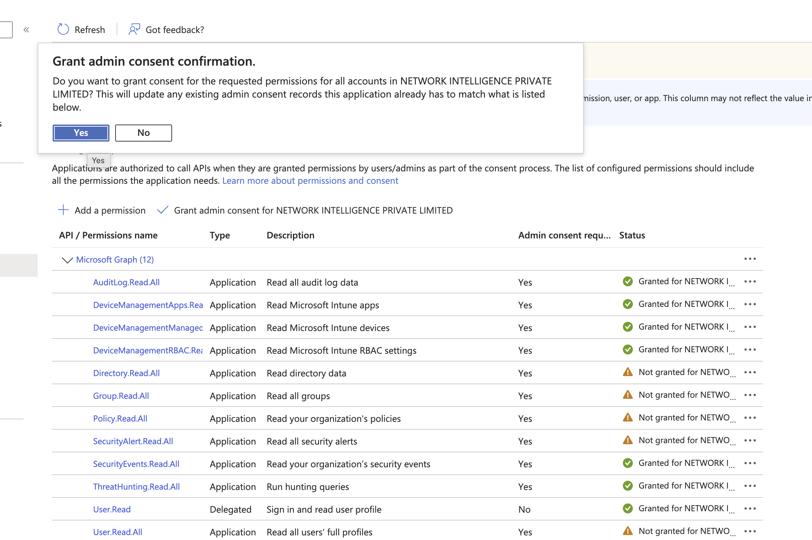

5. Verify that every required permission shows **Granted for _tenant name_**.

The screenshot captures the confirmation step, so some rows still show **Not
granted**. After confirming and refreshing the page, every permission required
by this guide must show **Granted**, and the permission type must be
**Application**. Remove any unneeded delegated permission before validation.

If a permission remains ungranted, have an authorized Entra administrator
complete consent before testing the connection.

## 6. Confirm the required log sources

Permissions allow Transilience to read available data; they do not enable a
Microsoft service, create a workspace, change diagnostic settings, or begin
collecting logs that the customer has not configured.

Confirm that the applicable sources already contain data:

- Entra sign-in, directory audit, provisioning, and identity-risk logs;
- Conditional Access, MFA, authentication-method, and Security Defaults
  configuration;
- Intune device, compliance, application, and audit evidence;
- Defender for Cloud recommendations, alerts, and security posture;
- Defender for Endpoint device, vulnerability, recommendation, software,
  score, and alert evidence;
- Azure Monitor metrics, alerts, activity, and diagnostic settings;
- Log Analytics queries and retained workspace data; and
- Microsoft Sentinel incidents, analytics rules, hunting data, and workspace
  security configuration.

If subscription or resource logs must be routed to a Log Analytics workspace,
the customer must configure that routing separately. The Transilience
application has read-only access and cannot change diagnostic settings.

Record the resource IDs of every approved Log Analytics and Sentinel workspace
for connection validation.

## 7. Secure handoff

Provide the following through the customer-specific secure location supplied
by Transilience:

- Directory (tenant) ID;
- Application (client) ID;
- client secret value and expiry date;
- approved subscription IDs;
- management-group ID, when used;
- approved Log Analytics and Sentinel workspace resource IDs;
- approved billing scopes, when used; and
- a non-secret record of all successful and unsuccessful role and permission
  grants.

The client secret value must not be sent through email, chat, a support ticket,
or an ordinary shared document. The secret ID is not a substitute for the
secret value and is not sufficient to authenticate.

## 8. Validate the connection

Use this checklist before considering onboarding complete:

- [ ] The application name is **Transilience Managed Compliance**.
- [ ] The tenant ID and client ID match the intended customer tenant.
- [ ] The secret is valid and its expiry is recorded.
- [ ] Every approved subscription is listed and readable.
- [ ] All required Azure RBAC roles are assigned at the correct scopes.
- [ ] Log Analytics and Sentinel workspace roles are present where inheritance
      is insufficient.
- [ ] Every required Microsoft Graph permission has tenant-wide admin consent.
- [ ] Every required Defender for Endpoint permission has tenant-wide admin
      consent.
- [ ] Entra, Intune, Defender, Azure Monitor, Log Analytics, and Sentinel return
      data for the products the customer uses.
- [ ] No Owner, Contributor, Reader and Data Access, storage `listKeys`, Key
      Vault secret-value, delegated Graph, or Graph `*.ReadWrite.*` access was
      granted.
- [ ] Credential material was transferred only through the approved secure
      channel.

## What Transilience cannot do with this access

This access does not allow Transilience to:

- create, update, or delete Azure resources;
- change users, groups, roles, MFA, Conditional Access, or Intune policy;
- dismiss alerts or initiate remediation actions;
- change diagnostic settings or log routing;
- read Key Vault secret values or key material;
- retrieve storage account keys; or
- sign in as the administrator who configured the application.

## Revocation

To revoke access:

1. Delete the **Transilience Managed Compliance** app registration. This also
   removes its tenant-local service principal.
2. Remove any remaining Azure RBAC assignments for the application from
   subscriptions, management groups, workspaces, billing scopes, AKS clusters,
   and App Configuration stores.
3. Confirm that the application no longer appears in enterprise applications
   and that the client secret can no longer authenticate.

## Source and reference material

- [Extended Azure access and guided installer](azure.md)
- [Manual subscription onboarding](https://transilience.freshdesk.com/support/solutions/articles/154000228911-onboard-azure-account-for-transilience-managed-compliance)
- [Manual Azure log-access onboarding](https://transilience.freshdesk.com/support/solutions/articles/154000238630)
- [Microsoft Graph permissions reference](https://learn.microsoft.com/en-us/graph/permissions-reference)
- [Azure built-in roles](https://learn.microsoft.com/en-us/azure/role-based-access-control/built-in-roles)
- [Supported Microsoft Defender for Endpoint APIs](https://learn.microsoft.com/en-us/defender-endpoint/api/exposed-apis-list)
- [Apps and service principals in Microsoft Entra ID](https://learn.microsoft.com/en-us/entra/identity-platform/app-objects-and-service-principals)
- [Application permissions and admin consent](https://learn.microsoft.com/en-us/entra/identity-platform/app-only-access-primer)
