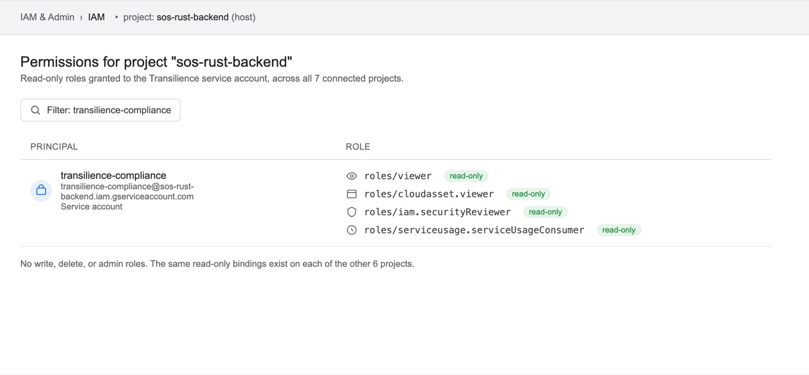

# Google Cloud install

Connect Google Cloud read-only with a single command in **Google Cloud Shell**. It creates a
dedicated read-only service account across all your projects and connects to Transilience
automatically — no keys to email, nothing to install locally.

## When this applies

Use this guide whenever a question matches any of these:

- "How do I connect Google Cloud / GCP?"
- "GCP setup" / "GCP onboarding"
- "How do I run the GCP CSPM app?"
- "How do I disconnect / reconnect Google Cloud?"
- Any question that names Google Cloud or GCP in the context of connecting, setting up, or
  removing access.

## What you need

- A user who can create a service account and grant roles in your Google Cloud projects (an
  **Owner** or equivalent on the host project).
- Access to **Google Cloud Shell** (`shell.cloud.google.com`).
- About 3 minutes. Everything is **read-only** — nothing is changed, deleted, or created beyond a
  dedicated read-only service account.

## Connect Google Cloud

1. In Transilience, go to **Integrations**, find the **Google Cloud** row, and click **Connect**.
2. Click **Open Google Cloud Cloud Shell** and paste the one-liner shown on the card. It runs the
   read-only installer with a one-time token:

   ```bash
   curl -sSL https://transiliencepublic.s3.us-east-1.amazonaws.com/cloudformation-templates/install-scripts/google-cloud-compliance.sh \
     | bash -s -- --legacy-json-key --external-id <your-one-time-token> \
       --complete-url https://onboarding.transilience.cloud/onboarding/gcp-complete
   ```

   > Tip: run `gcloud config set project <host-project>` first if you want the service account
   > created in a specific project.

3. The installer assesses every project you can access, reuses (or creates) the
   `transilience-compliance` service account, grants the read-only roles, mints a key, and
   registers the connection:

   ```text
   No scope supplied; assessing all 7 accessible project(s).
   Reusing service account: transilience-compliance@<host>.iam.gserviceaccount.com
   Verified: roles/viewer on project <project> …
   Verified: roles/cloudasset.viewer on project <project> …
   Verified: roles/iam.securityReviewer on project <project> …
   created key […] of type [json] for [transilience-compliance@<host>.iam.gserviceaccount.com]
   Transilience connection activated automatically.
   Google Cloud onboarding is complete.
   ```

4. Back in Transilience the **Google Cloud** row shows **Connected** with your project count.

## What access you granted

Every role is **read-only** — no write, delete, or admin permissions. Granted to the dedicated
`transilience-compliance` service account on **each connected project**:

| Role | Covers |
|---|---|
| `roles/viewer` | Read resource configuration across services |
| `roles/cloudasset.viewer` | Read the Cloud Asset inventory |
| `roles/iam.securityReviewer` | Read IAM policies and bindings |
| `roles/serviceusage.serviceUsageConsumer` | Use enabled service APIs (host project) |

## Verify exactly what access you granted

You can confirm the exact roles at any time in the Google Cloud Console:

1. Open **IAM & Admin → IAM** (for the host project) and filter for **`transilience-compliance`**.
   You'll see the service account with only the read-only roles above.



2. To see the credential itself, open **IAM & Admin → Service Accounts →
   `transilience-compliance` → Keys**. There is exactly one user-managed key (the one Transilience
   holds).

Or check from Cloud Shell:

```bash
# roles the service account holds on a project
gcloud projects get-iam-policy <project> \
  --flatten="bindings[].members" \
  --filter="bindings.members:transilience-compliance@<host>.iam.gserviceaccount.com" \
  --format="value(bindings.role)"

# keys on the service account (should be exactly one)
gcloud iam service-accounts keys list \
  --iam-account=transilience-compliance@<host>.iam.gserviceaccount.com --managed-by=user
```

## Removing access

- **Disconnect** on the Integrations page removes the credential Transilience stores and stops
  future scans. It does **not** delete the service account or its roles in your Google Cloud.
- To remove everything in Google Cloud too, re-run the installer with **`--uninstall`** in Cloud
  Shell — it removes the role bindings and the service account.

## Reconnecting

If you disconnect and then reconnect, the installer needs to mint a **fresh** key. Because the
service account already has a user-managed key from the previous connection, delete that key first
(or run `--uninstall` and reinstall):

```bash
# list, then delete the existing user-managed key, then re-run the connect one-liner
gcloud iam service-accounts keys list \
  --iam-account=transilience-compliance@<host>.iam.gserviceaccount.com --managed-by=user
gcloud iam service-accounts keys delete <KEY_ID> \
  --iam-account=transilience-compliance@<host>.iam.gserviceaccount.com
```

## Related

- [Apps](../concepts/apps.md) — what you'll run once Google Cloud is connected.
- [Outputs](../concepts/outputs.md) — the dashboards and reports the app produces.
- [Scheduling](../concepts/scheduling.md) — run the app on a recurring schedule.
