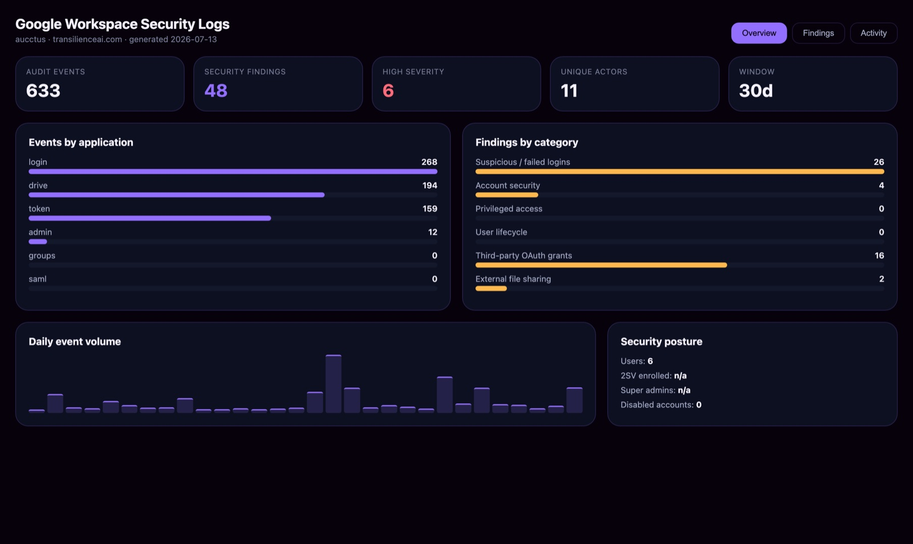
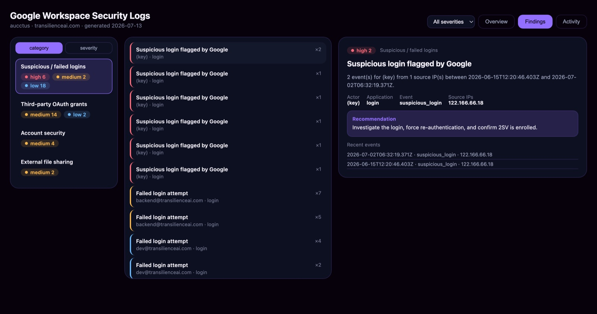

# Google Workspace install

Connect Google Workspace once — with a read-only, admin-approved sign-in — then run the
**Google Workspace Logs** app to turn your audit logs into ranked security findings:
suspicious logins, risky OAuth grants, external Drive sharing, and 2-step-verification gaps.

## When this applies

Use this guide whenever a question matches any of these:

- "How do I connect Google Workspace?"
- "Google Workspace setup" / "Workspace onboarding"
- "How do I monitor Google Workspace logs / sign-ins / audit logs?"
- "How do I run the Google Workspace Logs app?"
- Any question that names Google Workspace / Workspace / GWS in the context of connecting,
  installing, or setting up log monitoring.

## What you need

- A **Google Workspace administrator** account (admin approval is what lets Transilience read
  reports for your whole domain — a regular user account won't work).
- About 2 minutes. Everything below is **read-only**: it can't change, send, or delete anything
  in your Workspace.

## Connect Google Workspace

1. **Open Integrations.** In Transilience, go to **Integrations** and find the **Google Workspace**
   row in *Cloud & workspace connections*.
2. **Click "Connect Google Workspace".** This starts a standard Google sign-in — Transilience never
   sees your password.
3. **Choose your admin account.** Pick the account of a Google Workspace administrator.
4. **Review the read-only access and click Continue.** Google shows exactly what's requested — two
   read-only report scopes (`admin.reports.audit.readonly` and `admin.reports.usage.readonly`) and
   nothing that can change or delete anything. Because these are admin-level report scopes, one
   admin's approval covers the whole domain — no domain-wide delegation, no service-account keys.
5. **You're connected.** Google returns you to Transilience and the Google Workspace row flips to
   **Connected**, showing your domain and the admin who approved it.

## Run the Google Workspace Logs app

1. Go to **Apps** and choose **Google Workspace Logs**.
2. Click **Continue** to run. Transilience pulls the last 30 days of audit activity across logins,
   admin actions, OAuth tokens, and Drive sharing, then ranks what it finds (a few seconds).
3. Read the **Overview** — audit events analyzed, findings by severity, activity by application,
   and posture at a glance.

4. Open **Findings** to explore by category or severity. Each finding names the actor, the source
   IPs, the exact events and times, and a recommended next step.

Want it hands-off? [Schedule](../concepts/scheduling.md) the app to run daily or weekly.

## What Transilience reads

Only Google's read-only Admin SDK report scopes (`admin.reports.audit.readonly` and
`admin.reports.usage.readonly`). It **cannot** read email or file contents, and it **cannot**
change, send, or delete anything. The Admin SDK API must be enabled on the platform's OAuth
project (a one-time, platform-side step) for the reports to return data.

## Removing access

Click **Disconnect** on the Integrations page anytime — Transilience revokes the token and deletes
the stored credential. You can also revoke it from your Google Account's security settings.

## Related

- [Apps](../concepts/apps.md) — what you'll run once Google Workspace is connected.
- [Outputs](../concepts/outputs.md) — the dashboards and reports the app produces.
- [Scheduling](../concepts/scheduling.md) — run the app on a recurring schedule.
